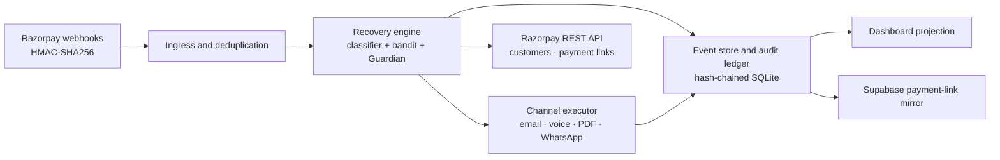

# Cadence

## Autonomous Revenue Recovery & Mandate Defense for Indian Recurring Payments

Cadence is an autonomous AI revenue-recovery agent for failed Indian recurring payments on Razorpay.
It observes a failure, chooses a safe recovery action, creates the customer message, and records proof for every decision.

<sub>Python 3.12 · FastAPI · React 19 + Vite · Event-sourced SQLite · Supabase mirror · 472 tests</sub>

## The problem

Recurring UPI AutoPay collection is high-volume, but failed debits create involuntary churn. Moneycontrol, citing NPCI data, reported that UPI AutoPay success fell from about **50% in January 2024 to about 30% in November 2025**. At the same time, the top ten banks processed about **926 million AutoPay transactions** in November 2025. A failed debit needs a timely, suitable follow-up—not just another generic retry.

| Evidence | What it shows |
| --- | --- |
| [Moneycontrol, citing NPCI data](https://www.moneycontrol.com/news/business/startup/why-merchants-prefer-upi-autopay-despite-a-lower-success-rate-than-cards-13762634.html) | AutoPay success fell from about 50% to about 30%. |
| [Economic Times](https://economictimes.indiatimes.com/tech/technology/upi-autopay-volume-doubles-in-a-year-npci-launches-portal-for-e-mandate-management/articleshow/126172927.cms) | Top ten banks processed about 926m AutoPay transactions in Nov. 2025, up from 530.5m a year earlier. |
| [Livemint](https://www.livemint.com/companies/start-ups/upi-autopay-failures-recurring-payments-india-11759999218161.html) | Some merchants reported failure rates up to 90%. |
| [Livemint](https://www.livemint.com/industry/banking/rbi-npci-upi-autopay-debits-complaints-mandates-recurring-payments-11771480657742.html) | RBI asked NPCI to review UPI AutoPay issues. |

A 30% first-attempt success rate means roughly seven in ten debits may need recovery. Merchants also have a short operating window before a mandate is cancelled or the customer churns. Recovery must respect customer context, consent, quiet hours, mandate state, and hard-decline signals.

## Cadence in one minute

Cadence runs a bounded **observe → decide → act → prove** loop:

1. **Observe** — Verify a Razorpay webhook and classify the failure reason.
2. **Decide** — Use a contextual bandit to choose a channel and a Guardian to reject unsafe actions.
3. **Act** — Create a contextual Hinglish message and execute the permitted recovery action.
4. **Prove** — Append the event, decision, action, and outcome to a SHA-256 hash-chained audit log.

## Why this is an AI revenue-recovery agent

Cadence is not a chat wrapper. Its agent behaviour is split into clear, testable parts:

| Component | Role |
| --- | --- |
| **Failure classifier** | Maps Razorpay failure information to causes such as `NO_FUNDS`, `BANK_DOWN`, `TIMEOUT`, `BAD_VPA`, `EXPIRED_INSTRUMENT`, and `CUSTOMER_ABORTED`. |
| **Contextual bandit** | LinUCB chooses among recovery channels using the failure and customer context, then learns from outcomes. |
| **LLM writer** | Produces a customer-specific Hinglish recovery nudge. It cannot invent amounts or payment links. |
| **Guardian** | Applies nine hard safety and compliance rules before any outbound action. Guardian vetoes override the bandit and LLM. |

The dashboard exposes the reasoning in plain language: what Cadence saw, what it considered, and what it did. `GET /api/audit/verify` recomputes the chain so tampering is detectable.

## What happens when a payment fails

1. Razorpay sends a signed `payment.failed` event to Cadence.
2. Cadence verifies the HMAC signature and deduplicates the delivery.
3. The classifier identifies the likely cause and the journey state machine opens or updates the recovery journey.
4. The bandit proposes an intervention; the Guardian checks it against mandate, timing, quiet-hour, amount, touch-cap, decline, and kill-switch rules.
5. If permitted, Cadence generates the message and dispatches the selected channel.
6. A later payment or lifecycle event updates the journey, dashboard, Supabase mirror, and append-only audit chain.

## Architecture



Cadence is event-sourced: journey state is rebuilt from append-only events. Each audit hash covers the previous hash, which links the decision history into a verifiable sequence.

## Razorpay integration and live proof

Cadence has real Razorpay **test-mode** integration. The Live Recovery flow creates a test customer and payment link, then passes a signed webhook through the same ingress used for webhook delivery. No recorded fixture is required for that path.

| Integration | Cadence behaviour |
| --- | --- |
| `payment.failed` | Verifies the webhook, classifies the failure, opens a recovery journey, and proposes an action. |
| `payment.captured` / `payment_link.paid` | Closes the recovery journey when payment success is received. |
| Customer and payment-link APIs | Creates, fetches, and—when a recovery window expires—cancels test-mode payment links. |
| Resend | Optionally sends the generated recovery email. |
| Supabase | Mirrors payment-link rows for the Dashboard without exposing a service key to the browser. |

**Important boundary:** Razorpay does not provide an API that marks a Payment Link as paid. The Test Lab’s “customer pays” drill closes Cadence’s journey through a signed synthetic webhook; it reports Razorpay’s actual upstream link status honestly. The expiry drill makes a real Razorpay payment-link cancellation request, so the upstream link becomes `cancelled`.

## Product walkthrough

The visible product navigation has three focused surfaces:

| Surface | Purpose |
| --- | --- |
| **Live Recovery** | Demonstrates a full recovery flow: create a test customer, trigger a failure, inspect the agent decision, and close the journey. |
| **Dashboard** | Shows payment links, recovery status, amounts, agent reasoning, lifecycle records, and the audit chain in a Razorpay-style table and drawer. Rows refresh from Cadence’s event projection; the optional cloud mirror is available through Supabase. |
| **Test Lab** | Runs controlled drills: duplicate delivery, concurrent failures, Guardian kill switch, payment-link lifecycle outcomes, and a bounded autonomous lifecycle choice. |

Specialized modules (Mandate Sequencer, Pre-Debit Nudge, Checkout Drop-Off, B2B Invoices, and Pay Portal) remain hash-routable via sidebar navigation.

## Safety and compliance: the Guardian

The Guardian evaluates every proposed recovery action. It records blocks as audit events instead of silently skipping them.

| Rule | Effect |
| --- | --- |
| UPI cooling period | Blocks an impermissibly early UPI AutoPay retry. |
| Pre-debit notice | Requires the configured notice window before a new debit. |
| Quiet hours | Suppresses outbound contact during configured IST quiet hours. |
| Hard-decline stop | Blocks further automated recovery for loss, theft, fraud, or equivalent hard declines. |
| Mandate validity | Rejects action for an expired or halted mandate. |
| Touch cap | Limits customer contacts in a rolling window. |
| Frequency decay | Escalates repeated failed attempts rather than repeatedly nudging. |
| Amount ceiling | Requires human review above the configured amount. |
| Kill switch | Immediately halts outbound actions while preserving evidence of each blocked request. |

These controls are implementation safeguards for the demo, not legal advice. Production deployment needs merchant-specific policy review and current NPCI, RBI, TRAI, and Razorpay compliance checks.

## Results and reproducibility

Cadence’s evaluation reports a **+25.8% mean recovery lift** over a fixed retry baseline across five deterministic seeds of 50 subscribers each.

| Seed | Fixed retry baseline | Cadence policy | Lift |
| --- | ---: | ---: | ---: |
| 42 | 48.0% | 54.0% | +6 pp |
| 7 | 48.0% | 70.0% | +22 pp |
| 99 | 48.0% | 56.0% | +8 pp |
| 123 | 48.0% | 62.0% | +14 pp |
| 2024 | 48.0% | 60.0% | +12 pp |
| **Mean** | **48.0%** | **60.4%** | **+12.4 pp / +25.8%** |

Reproduce the evaluation after starting the API:

```powershell
curl "http://127.0.0.1:8000/api/eval/agent-compare?seeds=42,7,99,123,2024&n=50"
```

This is a **calibrated simulation**, not a claim of production lift. The endpoint remains available for reproducibility and evaluation; it is not presented as a default product UI comparison.

## Revamp capabilities and evidence boundary

| Capability | Implemented behaviour | Evidence boundary |
| --- | --- | --- |
| **Mandate retry sequence** | Guardian permits sequence 1 plus retries 1–3 (sequences 2–4), then hard-vetoes sequence 5 with `mandate_retry_limit_exhausted`. Approved audit records expose sequence and retry number. | Cadence policy and hash-chained audit evidence; not a bank-side mandate-control claim. |
| **Pre-debit prevention** | `POST /api/predebit/schedule` records `predebit.scheduled` and either `predebit.notified` or a Guardian veto. Test Lab displays the result. | Controlled local audit workflow; no Razorpay call and no claim of a known bank balance. |
| **Checkout-idle recovery** | `POST /api/checkout-idle/scan` finds an old, still-`created` Payment Link, appends `checkout.idle_detected`, classifies `ABANDONED_CHECKOUT`, and permits only one Guardian-approved message. | Self-managed local Payment Link projection; not Razorpay Magic Checkout abandoned-cart data. Paid, cancelled, and expired links are skipped. |
| **Calibrated evidence** | Dashboard runs five fixed seeds × 50 synthetic subscribers against the same fixed-retry baseline and Cadence policy. | Deterministic local simulation, clearly labelled **not production performance**; it is separate from live Payment Link totals. |

The Dashboard keeps the two evidence classes separate: Razorpay Test Mode link/customer/cancellation facts remain live-provider evidence, while the calibrated card is reproducible local policy evidence.

## Quickstart

From the repository root on Windows:

```powershell
.\start.bat
```

Open <http://127.0.0.1:3000>. The API runs at <http://127.0.0.1:8000>.

For a manual setup:

```powershell
git clone https://github.com/JoelDlima/Cadence.git
cd Cadence
Copy-Item Cadence\.env.example Cadence\.env
.\start.bat
```

Cadence runs offline with no keys. In that mode, integrations use deterministic simulators and responses identify simulated output. Add only the keys needed for a live test-mode demo:

| Variable | Enables |
| --- | --- |
| `RZP_KEY_ID`, `RZP_KEY_SECRET`, `RZP_WEBHOOK_SECRET` | Razorpay test-mode customers, payment links, and signed webhook checks. |
| `GROQ_API_KEY` | LLM-written recovery message. |
| `RESEND_API_KEY` | Email delivery. |
| `ELEVENLABS_API_KEY` | Voice preview. |
| `SUPABASE_URL`, `SUPABASE_SERVICE_KEY` | Cloud payment-link mirror. |

See [`Cadence/.env.example`](./Cadence/.env.example) for documented defaults. Keep `.env` private; it is ignored by Git.

To add the optional Supabase payment-link mirror table:

```powershell
cd Cadence
.venv\Scripts\python.exe scripts\supabase_apply_plink_table.py
```

The script applies [`V7__cadence_payment_links.sql`](./Cadence/supabase/migrations/V7__cadence_payment_links.sql) when configured, or prints the SQL for the Supabase SQL editor. Cadence still runs if the mirror is not configured.

## API

There are 61 route decorators across the FastAPI application and routers. The high-value endpoints are below; full OpenAPI is at <http://127.0.0.1:8000/openapi.json>.

| Method | Path | Purpose |
| --- | --- | --- |
| `POST` | `/webhooks/razorpay` | HMAC-verified Razorpay webhook ingress. |
| `POST` | `/api/live/customer` | Creates a Razorpay test-mode customer. |
| `POST` | `/api/live/failure` | Creates a payment link and processes a signed failure event. |
| `POST` | `/api/live/payment-paid` | Processes a close-the-loop payment event. |
| `POST` | `/api/live/lifecycle/{force-paid,force-failed,force-expired,complete-journey}` | Deterministic lifecycle drills; expiry performs the real Razorpay cancel call. |
| `POST` | `/api/live/lifecycle/smart` | Bounded autonomous lifecycle decision with deterministic fallback. |
| `POST` | `/api/checkout-idle/scan` | Detects old locally-projected `created` Payment Links and routes one bounded `ABANDONED_CHECKOUT` message; not Magic Checkout data. |
| `POST` | `/api/predebit/schedule` | Test-safe preventive pre-debit audit workflow; no Razorpay call. |
| `GET` | `/api/dashboard/payment-links` | Dashboard payment-link projection. |
| `GET` | `/api/dashboard/stats` | Dashboard recovery and risk statistics. |
| `GET` | `/api/cloud/plinks` | Server-side Supabase payment-link mirror read. |
| `GET` | `/api/journey/{id}/reasoning` | Human-readable agent reasoning. |
| `GET` | `/api/audit/verify` | Recomputes and verifies the SHA-256 audit chain. |
| `GET` | `/api/eval/agent-compare` | Reproducible calibrated evaluation. |

## Verification

Known project checks:

```powershell
cd Cadence

# Full backend suite
.venv\Scripts\python.exe -m pytest -q

# Offline lifecycle and Dashboard smoke check
.venv\Scripts\python.exe scripts\verify_5_drills.py

# Confirm Razorpay credentials with a read-only call
.venv\Scripts\python.exe scripts\check_razorpay_keys.py

# Frontend type check and production build
cd frontend
npm run build
```

Run the full backend suite and the frontend production build before recording or publishing. The `--live` lifecycle smoke option uses Razorpay test mode; use it sparingly to avoid creating unnecessary test records.

## Limitations

- The evaluation result is based on a calibrated simulation, not a multi-month production rollout.
- Cadence cannot force Razorpay to mark a Payment Link paid; only a real customer payment changes that upstream status.
- SQLite is appropriate for the single-process demo. A multi-instance deployment should use a shared database such as Postgres.
- Email and voice integrations are optional test/sandbox integrations; production scale requires appropriate provider accounts and consent workflows.
- The WhatsApp demo path is a deep link, not a production WhatsApp Business API integration.

## Repository map

```text
Cadence/
├── README.md
├── References.md
├── start.bat / start.sh
└── Cadence/
    ├── src/cadence/
    │   ├── api/          FastAPI app and live routes
    │   ├── ingest/       Razorpay verification and ingestion
    │   ├── journey/      State machine and recovery engine
    │   ├── policy/       Guardian rules and LinUCB bandit
    │   ├── executors/    Channel dispatcher and Razorpay client
    │   ├── cloud/        Supabase mirrors
    │   └── sim/          Calibrated evaluation
    ├── frontend/         React, TypeScript, and Vite
    ├── supabase/         Schema migrations and functions
    ├── scripts/          Setup, reset, validation, and drill helpers
    ├── tests/            472 test cases
    └── docs/             Architecture and 5-minute demo script
```

The phone-readable recording script is available at [`Cadence/docs/demo-script.pdf`](./Cadence/docs/demo-script.pdf).

## License and contact

[MIT](./LICENSE) © Joel D'lima. Commercial use is permitted; please do not imply Razorpay endorsement.

- **Maintainer:** [Joel D'lima](https://github.com/JoelDlima)
- **Repository:** <https://github.com/JoelDlima/Cadence>
- **Focus:** Autonomous AI Revenue Recovery & Mandate Defense for Indian Recurring Payments

External sources are collected in [References.md](./References.md).
