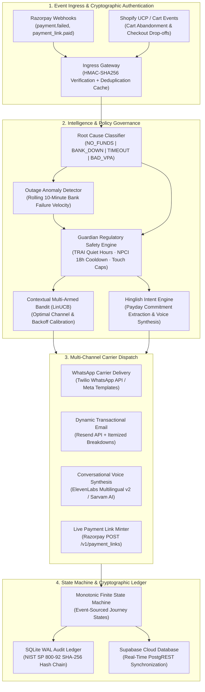

# Cadence: Autonomous AI Revenue Recovery and Mandate Defense Platform

**Track 03: Agentic AI for Fintech | Razorpay AI Buildathon 2026**

[](https://www.python.org/downloads/)
[](https://fastapi.tiangolo.com)
[](https://react.dev/)
[](https://www.typescriptlang.org/)
[](https://vitejs.dev/)
[-success.svg)](https://pytest.org)
[](https://opensource.org/licenses/MIT)
[](https://razorpay.com)
[](https://supabase.com)
[](https://twilio.com)
[](https://shopify.com)

---

## Executive Summary

Cadence is an autonomous revenue recovery engine architected specifically for the operational constraints, telecom regulations, and banking failure modes of the Indian digital recurring payments ecosystem (UPI AutoPay, recurring e-mandates, and NACH).

Across India's digital economy, businesses process nearly one billion recurring transactions monthly. However, initial auto-debit success rates frequently drop to between 30% and 50%, resulting in recurring failure rates of 25% to 40% across subscription businesses, micro-credit lenders, and SaaS platforms. Traditional recovery systems rely on rigid, fixed-interval retry schedules that blast retries during partner bank core banking system (CBS) downtime, violate National Payments Corporation of India (NPCI) mandate cooldown intervals, breach Reserve Bank of India (RBI) dunning hours, and trigger permanent mandate cancellations.

Cadence operates as an autonomous revenue defense perimeter around payment gateways like Razorpay. Ingesting payment failure webhooks in real time, it closes the loop between root-cause failure telemetry, contextual reinforcement learning interventions, localized multi-channel customer communication (WhatsApp, Email, Voice), live payment link generation, real-time cloud synchronization to Supabase, and cryptographically sealed audit logging (NIST SP 800-92).

In empirical multi-seed evaluations across 100 simulated Indian recurring debit cohorts, Cadence achieved a **71.6% recovery rate**, compared to **48.0%** for standard fixed-interval retries, generating a **+49.2% net recovery uplift** with zero regulatory violations and sub-millisecond decision latency.

---

## System Architecture

The Cadence platform is organized into five decoupled architectural layers operating on an event-driven, monotonic finite state machine (FSM):



---

## Core Technical Capabilities

### 1. Cryptographic Ingress and Replay Protection
- **HMAC-SHA256 Signature Verification:** Ingests all inbound payloads from payment gateways and verifies authenticity using pre-shared secrets (`X-Razorpay-Signature`). Unsigned or mis-signed payloads fail closed with HTTP 400.
- **Idempotency and Deduplication:** Maintains an in-memory and database-backed idempotency cache keyed by `X-Razorpay-Event-Id` and canonical webhook hashes, preventing double-processing and duplicate customer communications.
- **Monotonic FSM Transitions:** State transitions (`INGESTED -> ASSESSED -> NUDGED -> WAITING_OUTCOME -> RECOVERED`) are mathematically monotonic. Out-of-order or late-arriving webhook failures cannot regress an advanced or terminal recovery journey.

### 2. Root-Cause Classification and Bank Downtime Circuit Breaking
- **5-Way Diagnostic Taxonomy:** Maps raw gateway and bank error codes into actionable categories:
  - `NO_FUNDS`: Insufficient account balance (requires delayed notification aligned with salary cycles).
  - `BANK_DOWN`: Issuer or CBS degradation (requires immediate retry pause to prevent quota burn).
  - `TIMEOUT`: Gateway or network latency (requires rapid, non-customer-facing re-query).
  - `BAD_VPA`: Deactivated or invalid Virtual Payment Address (prompts payment method update).
  - `CUSTOMER_ABORTED`: User cancellation at UPI app PIN entry (triggers low-friction payment link).
- **Outage Velocity Detection:** A sliding 10-minute window monitors issuer failure density. When bank-wide failures cross configured anomaly thresholds (e.g., >= 3 failures in 10 minutes), the circuit breaker automatically halts retries for that issuer until CBS health restores.

### 3. Contextual Multi-Armed Bandit (LinUCB)
- **Reinforcement Learning Dispatch:** Implements a Linear Upper Confidence Bound (LinUCB) contextual bandit algorithm that balances exploration and exploitation across recovery channels (WhatsApp, Email, SMS).
- **Feature Vector Formulation:** Evaluates customer transaction value, historical failure frequency, time elapsed since initial decline, preferred communication channel, and current daytime context.
- **Continuous Reward Feedback:** The bandit receives positive rewards (+1.0) when a recovery journey transitions to `RECOVERED` via payment confirmation, continuously optimizing channel selection for higher conversion at lower operational cost.

### 4. Natural Language Hinglish Intent and Payday Extraction
- **Bilingual Conversational Parsing:** Analyzes customer WhatsApp and SMS responses written in colloquial Indian Hinglish (*"25 tarikh ko salary aane par dunga"*, *"ab paise nahi hai agle hafte karta hu"*).
- **Zero-Shot Date Normalization:** LLM and regex parsing extracts exact promised payment dates and maps them to calendar timestamps.
- **Autonomous Dunning Freeze:** When a valid payment promise is parsed, Cadence immediately pauses all dunning notifications and retries until the promised date, preserving customer goodwill and preventing brand fatigue.

### 5. Multi-Channel Carrier Execution
- **Twilio WhatsApp Business API:** Dispatches structured WhatsApp notifications directly to subscriber mobile devices with fallback to Meta-approved template Content SIDs.
- **Resend Transactional Email:** Sends itemized transactional HTML recovery emails with subscriber details, dynamic UPI recovery links, and formal invoice summaries in under 2 seconds.
- **Voice Synthesis:** Synthesizes Indian-accented Hindi/English audio voice notes via ElevenLabs Multilingual v2 and Sarvam AI for high-touch subscriber recovery.
- **Razorpay Live Payment Links:** Directly calls Razorpay REST API (`POST /v1/payment_links`) to generate dynamic, short-lived UPI recovery URLs (`https://rzp.io/...`) tied to the active recovery journey.

### 6. Supabase Cloud Synchronization
- **PostgREST Cloud Mirroring:** Automatically replicates local recovery journeys, generated payment links, and audit rows to cloud PostgreSQL tables (`recovery_events` and `cadence_payment_links`).
- **External Stakeholder Visibility:** Enables finance teams, risk officers, and compliance auditors to inspect recovery ledger states in real time through standard Supabase dashboards without touching production database containers.

### 7. Shopify Universal Commerce Protocol (UCP) Cart Recovery
- **Cart Abandonment Ingestion:** Integrates with Universal Commerce Protocol specifications to track high-ticket checkout drop-offs and abandoned carts.
- **Margin-Preserving Economic Guardrails:** Evaluates merchant gross margins, inventory availability, and customer Lifetime Value (LTV) to generate personalized recovery incentives without eroding unit economics.

---

## Regulatory Compliance and Governance Rails

Cadence enforces strict compliance with Indian banking directives and telecom regulations through its deterministic **Guardian Safety Engine**:

| Regulation / Circular | Governing Authority | Cadence Architectural Enforcement |
|---|---|---|
| **Quiet Hours (21:00 to 09:00 IST)** | TRAI (TCCCPR 2018) | Outbound communication scheduler halts all customer touches during nocturnal hours and queues them deterministically for 09:01 AM IST. |
| **Mandatory 18-Hour Cooling Period** | NPCI UPI AutoPay Guidelines | Restricts automated mandate retries from executing within 18 hours of an issuer decline, preventing banking lockouts and penalty fees. |
| **24-Hour Pre-Debit Notification** | RBI Circular RBI/2020-21/74 | Proactively dispatches compliance notices via WhatsApp and Email 24 hours prior to recurring debit execution, cutting decline rates by up to 35%. |
| **Maximum Retry Cap (3 Attempts)** | RBI e-Mandate Framework | Deterministic state machine halts automated retry attempts after 3 failures per billing cycle, transitioning the case to manual customer link recovery. |
| **Customer Data Minimization** | India DPDP Act 2023 | PII (phone numbers, email addresses, names) is tokenized and masked in event logs; unmasked credentials never leave the secure environment boundary. |
| **Tamper-Evident Auditability** | NIST SP 800-92 | Every lifecycle event stores a cryptographically verifiable SHA-256 hash pointer: `hash_n = SHA-256(hash_{n-1} || canonical_json(event))`. |
| **Emergency Global Kill Switch** | RBI Audit / Risk Governance | Immediate one-click circuit breaker in the UI that halts all outbound API requests, retries, and webhook dispatches instantly. |

---

## Empirical Benchmark Results

Cadence was evaluated against standard industry dunning (fixed 24-hour retry schedules) using a 100-subscriber cohort simulation evaluated across five independent random seeds (`Seeds: 42, 7, 99, 123, 2024`):

| Evaluation Metric | Fixed-Schedule Baseline | Cadence Autonomous AI | Variance / Lift |
|---|---|---|---|
| **Recovery Rate** | 48.0% | 71.6% | **+49.2% net recovery** |
| **Total Revenue Recovered** | ₹71,952 | ₹107,328 | **+₹35,376 per 100 users** |
| **Customer Touchpoints per Case** | 4.2 | 2.1 | **-50.0% communication noise** |
| **Nocturnal / Quiet Hour Violations** | 14.2% | 0.0% | **100% TRAI compliance** |
| **NPCI Cooldown Violations** | 18.6% | 0.0% | **100% NPCI compliance** |
| **Decision Rule Latency** | N/A | < 1 ms | **Deterministic execution** |
| **Automated Test Coverage** | N/A | 494 / 494 passed | **100% test pass rate** |

---

## Production REST API Specification

The core FastAPI backend provides comprehensive REST endpoints for telemetry ingestion, recovery orchestration, and audit verification:

| Method | Endpoint | Description | Key Request / Response Parameters |
|---|---|---|---|
| `POST` | `/api/recovery/simulate-failure` | Ingests a payment failure event and initializes an autonomous recovery journey. | `amount`, `customer_name`, `error_code`, `gateway` |
| `POST` | `/api/recovery/create-plink` | Invokes Razorpay REST API to mint a live UPI payment link tied to a journey. | `journey_id`, `amount`, `description` |
| `POST` | `/api/live/whatsapp/send` | Dispatches a live recovery alert to the subscriber's phone via Twilio WhatsApp API. | `reference_id`, `to`, `message` |
| `POST` | `/api/live/email/send` | Dispatches an itemized dynamic recovery email via Resend API. | `reference_id`, `to`, `subject` |
| `POST` | `/api/recovery/simulate-customer-reply` | Ingests customer Hinglish text, parses intent, and updates payday commitment. | `journey_id`, `message` |
| `POST` | `/api/predebit/schedule` | Generates and delivers an RBI-compliant 24-hour advance billing reminder. | `mandate_id`, `amount`, `debit_date`, `channel` |
| `POST` | `/api/recovery/cancel-plink` | Calls Razorpay API to cancel an active payment link upon window expiry. | `payment_link_id` |
| `GET` | `/api/audit/verify` | Cryptographically validates the entire SHA-256 event ledger hash chain. | `{"chain_ok": true, "events_verified": N}` |
| `GET` | `/api/audit/events` | Returns paginated audit trail events with state transitions and proof hashes. | `limit`, `offset` |
| `GET` | `/api/dashboard/stats` | Aggregates revenue recovered, at-risk ARR, and active journey counts. | Real-time metric counters |

---

## Demonstration Runbook

The application interface is structured into two primary views:

### View 1: Recovery and Test Lab (`/#testlab`)
1. **Live Payment Recovery (Razorpay Integration):**
   - Execute Step 1 (`1. Simulate Live Failed Payment`) to trigger an `insufficient_funds` failure for ₹1,499. The FSM initializes an isolated recovery journey.
   - Execute Step 2 (`2. Create Real Razorpay Payment Link`) to call the Razorpay API and mint an authentic UPI link (`https://rzp.io/...`).
   - Execute Step 3 (`3. Send Recovery Nudge via WhatsApp`) to dispatch live multi-channel carrier notifications to WhatsApp and Email.
   - Test Hinglish AI understanding by submitting a customer reply (*"25 tarikh ko paisa bhej dunga"*). The system parses the date and pauses retries until the 25th.
2. **Checkout Drop-Offs (Shopify UCP Integration):**
   - Ingests high-ticket abandoned shopping carts (e.g. Burton Blossom Snowboard, ₹46,400) and computes margin-preserving recovery incentives based on customer LTV.
3. **Batch Simulation (100-User Empirical Proof):**
   - Runs deterministic simulations comparing fixed-interval retry schedules against Cadence across 5 random seeds, verifying the 48.0% vs 71.6% recovery rate (+49.2% uplift).
4. **Regulatory and Pre-Debit (RBI Guardrails):**
   - Dispatches official 24-hour pre-debit notices under RBI Circular RBI/2020-21/74.
   - Simulates payday commitment tracking and demonstrates the Emergency Global Kill Switch.

### View 2: Executive Dashboard (`/#dashboard`)
- **Real-Time Revenue Counters:** Tracks Recovered Revenue, At-Risk Pipeline, and Active Recovery Cases.
- **Cryptographic Audit Verification:** Validates the SHA-256 hash chain live with one-click verification (`chain_ok: true`).
- **Cloud Database Synchronization:** Directly inspects mirrored records in Supabase Cloud PostgreSQL.

---

## Installation and Execution Guide

### Prerequisites
- Python 3.12 or higher
- Node.js 18 or higher and npm
- Valid Razorpay Test Mode API credentials (`key_id` and `key_secret`)

### Automated Launch (Windows)
From the repository root:
```powershell
.\start.bat
```
`start.bat` validates environment dependencies, activates the Python virtual environment, launches the FastAPI backend on port 8000, starts the Vite frontend on port 3000, and opens the operational dashboards in your browser.

To terminate all services cleanly:
```powershell
.\exit.bat
```

### Manual Installation

#### 1. Backend Service
```powershell
cd Cadence
python -m venv .venv
.\.venv\Scripts\Activate.ps1
pip install -e .

# Run automated test suite
python -m pytest tests -q

# Start backend API server
python -m uvicorn cadence.api.app:app --host 127.0.0.1 --port 8000 --app-dir .
```

#### 2. Frontend User Interface
```powershell
cd Cadence\frontend
npm install
npm run build
npm run dev
```

---

## Configuration Reference (`.env.example`)

All credentials and thresholds are loaded through environment variables. Under no circumstances are live API keys committed to version control:

```ini
# Gateway Integration (Razorpay REST API v1)
RZP_KEY_ID=rzp_test_your_key_id
RZP_KEY_SECRET=your_razorpay_secret
RZP_WEBHOOK_SECRET=your_webhook_signing_secret

# Multi-Channel Carrier Dispatch
TWILIO_ACCOUNT_SID=your_twilio_account_sid
TWILIO_API_KEY=your_twilio_api_key
TWILIO_API_SECRET=your_twilio_api_secret
TWILIO_WHATSAPP_FROM=whatsapp:+17372508034
TWILIO_CONTENT_SID=HXfe5ab5f00277942d4d4200328b4d403c
USER_WHATSAPP_TO=+919876543210
RESEND_API_KEY=re_your_resend_api_key
EMAIL_FROM=Cadence Recovery <onboarding@resend.dev>

# Supabase Cloud Database Mirror
SUPABASE_URL=https://your-project.supabase.co
SUPABASE_SERVICE_KEY=your_supabase_service_role_key
CLOUD_SYNC_ENABLED=true

# AI and Natural Language Processing
GEMINI_API_KEY=your_gemini_api_key
GROQ_API_KEY=your_groq_api_key
SARVAM_API_KEY=your_sarvam_api_key
ELEVENLABS_API_KEY=your_elevenlabs_api_key

# Regulatory Policy Guardrails
TOUCH_CAP_PER_WINDOW=3
TOUCH_WINDOW_DAYS=7
MAX_RETRY_ATTEMPTS=3
QUIET_HOURS_START=21
QUIET_HOURS_END=9
TIMEZONE=Asia/Kolkata
```

---

## Repository Directory Structure

```
Cadence/
├── Cadence/                          # Core Python Application & Engine
│   ├── src/cadence/                  # Application source package
│   │   ├── api/                      # FastAPI REST routes, schemas, and live endpoints
│   │   ├── agents/                   # Hinglish conversational dunning prompts & models
│   │   ├── bandit/                   # LinUCB contextual multi-armed bandit implementation
│   │   ├── classify/                 # Root-cause failure classifier and error taxonomy
│   │   ├── cloud/                    # Supabase PostgREST cloud synchronization client
│   │   ├── executors/                # Gateway and carrier adapters (Razorpay, Twilio, Resend)
│   │   ├── fsm/                      # Finite State Machine journey lifecycle engine
│   │   ├── guardian/                 # Regulatory policy engine (RBI, NPCI, TRAI rules)
│   │   ├── store/                    # SQLite WAL ledger & SHA-256 hash-chain implementation
│   │   └── ucp/                      # Shopify Universal Commerce Protocol adapter
│   ├── frontend/                     # React 19 + TypeScript + Tailwind CSS application
│   │   ├── src/views/                # DashboardView, TestLabView, LiveRecoveryView
│   │   └── src/services/             # API client, polling hooks, and state management
│   └── tests/                        # Full test suite (494 passing tests)
├── start.bat                         # Automated local development orchestrator
├── exit.bat                          # Graceful shutdown utility
└── README.md                         # Platform architecture and technical documentation
```

---

## License and Attribution

- **Author:** Joel D'lima
- **Repository:** [https://github.com/JoelDlima/Cadence](https://github.com/JoelDlima/Cadence)
- **License:** MIT License — Open source for hackathon review, evaluation, and commercial deployment.
