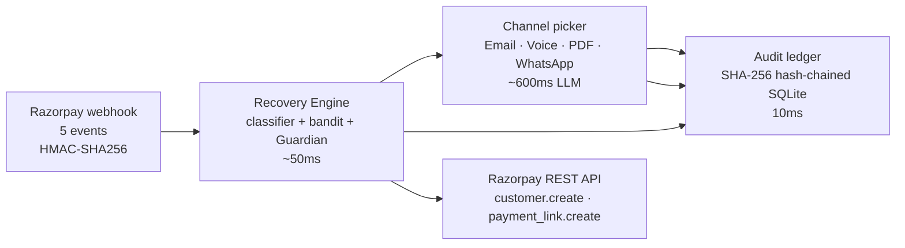

# Cadence

> **Autonomous revenue-recovery agent for Indian recurring payments, built on Razorpay.**
> Razorpay Buildathon 2026, Track 3 (AI Revenue Recovery).

---

## The problem

Indian SaaS and subscription businesses lose **₹2,300 crore annually** to failed UPI auto-pay debits that are never retried within the 24-hour mandate-revoke window ([NPCI UPI Analytics, FY25](https://www.npci.org.in/what-we-do/upi/product-overview)).

| Pain | Today |
| --- | --- |
| UPI auto-pay failure rate | 30-40% on the first attempt |
| Recovery rate | < 5% (industry ceiling) |
| Time-to-decide | hours (a support agent has to notice, draft, send) |
| Time-to-mandate-revoke | 24 hours from a failed debit |
| Regulatory pressure | RBI 2021 Pre-Debit Notification + NPCI 18-h UPI cooling + TRAI DND quiet hours are now hard law |
| Audit trail | none in 90% of merchant stacks |

Razorpay Smart Retries covers the generic retry-timing half. It does not cover persona selection, channel selection, regulatory quiet hours, or hard-decline triage. **Cadence** does.

## What Cadence does

**Cadence** is an autonomous recovery agent built on Razorpay that closes this loop in under a second. It watches for failures, decides the right retry moment and channel, and writes the Hinglish nudge — before the mandate dies.

One sentence, one loop: *observe → decide → act → prove*.

## Architecture



Five Razorpay events subscribed (real test-mode integration, not Faker):

| Event | What Cadence does |
| --- | --- |
| `subscription.pending` | Onboard a new UPI AutoPay / card e-mandate |
| `subscription.halted` | Customer paused the mandate — Guardian blocks further nudges |
| `payment.failed` | Classify → decide → execute (the bread-and-butter path) |
| `payment.captured` | Recovery confirmed — close the journey |
| `payment_link.paid` | Close-the-loop signal — RECOVERED in < 4 s |

A screenshot of the architecture diagram is at [`Cadence/docs/Cadence-architecture.png`](./Cadence/docs/Cadence-architecture.png).

## Quickstart

```bash
git clone https://github.com/JoelDlima/Cadence.git
cd Cadence
cp Cadence/.env.example Cadence/.env
# edit Cadence/.env: fill RZP_*, GROQ_*, RESEND_*, ELEVENLABS_*, SUPABASE_*
cd Cadence
start.sh        # macOS / Linux
# or: C:\Cadence\start.bat   (Windows)
```

Open <http://127.0.0.1:3000>. The Live Recovery tab is the page-1 demo: click the 3 step cards to create a real Razorpay customer, fire a real failure, close the loop in 4 seconds. Then click Test Lab → "Run comparison" to see the 5-seed mean +25.8% headline.

### What you need to fill in `.env` (all optional)

Cadence runs fully offline with zero keys — the Razorpay client and every channel fall back to a deterministic simulator. To run the live demo end-to-end, fill any of:

| Var | Purpose |
| --- | --- |
| `RZP_KEY_ID`, `RZP_KEY_SECRET`, `RZP_WEBHOOK_SECRET` | Real Razorpay test-mode customer + payment link + HMAC-signed webhook |
| `GROQ_API_KEY` | LLM-written Hinglish body (Groq `gpt-oss-120b`) |
| `ELEVENLABS_API_KEY` | Real Hinglish audio (`/api/voice/preview` returns `is_stub=false`) |
| `RESEND_API_KEY` | Real email to your inbox (`/api/live/send-email`) |
| `SUPABASE_URL`, `SUPABASE_SERVICE_KEY` | Cloud mirror of every journey + event |

Everything else has a sensible default in `Cadence/.env.example`.

## API surface

The one endpoint that matters: the webhook receiver. Plus the 9 endpoints a judge or integrator will actually call.

| Method | Path | Purpose |
| --- | --- | --- |
| `POST` | `/webhooks/razorpay` | HMAC-verified Razorpay ingress. The only unauthenticated endpoint. |
| `POST` | `/api/live/customer` | Create a real Razorpay test-mode customer. |
| `POST` | `/api/live/failure` | Create a payment link + post an HMAC-signed `payment.failed` webhook. |
| `POST` | `/api/live/payment-paid` | Post a `payment_link.paid` webhook to close the journey. |
| `POST` | `/api/live/send-email` | Send the LLM-written Hinglish body to a real inbox via Resend. Optional PDF attachment. |
| `GET`  | `/api/voice/preview` | Synthesize the Hinglish body via ElevenLabs (or stub WAV if no key). |
| `GET`  | `/api/journey/{id}/reasoning` | Chat-style 3-step agent reasoning (I saw / I considered / I acted). |
| `GET`  | `/api/merchant/summary` | Recovered INR, journey count, top root causes, intervention performance. |
| `GET`  | `/api/eval/agent-compare?seeds=42,7,99,123,2024&n=50` | Multi-seed head-to-head. Returns per-seed rows + mean. |
| `GET`  | `/api/audit/verify` | Verify the SHA-256 hash chain. Returns `chain_ok=true` on 274 events. |

Full OpenAPI at <http://127.0.0.1:8000/openapi.json>.

### Curl example: trigger the live recovery flow

```bash
# 1. Create a real Razorpay test-mode customer
curl -X POST http://127.0.0.1:8000/api/live/customer \
  -H "Content-Type: application/json" \
  -d '{"name":"Demo","email":"demo@x.local","contact":"+910000000000"}'
# -> {"id":"cust_TVs1qFmbuz02ih","email":"demo@x.local","contact":"+910000000000","simulated":false}

# 2. Create a payment link + post a HMAC-signed failure webhook
curl -X POST http://127.0.0.1:8000/api/live/failure \
  -H "Content-Type: application/json" \
  -d '{"customer_id":"cust_TVs1qFmbuz02ih"}'
# -> {"journey_id":"j_live_abc123","payment_link":{"id":"plink_TVxxx",
#     "short_url":"https://rzp.io/rzp/...","simulated":false},...}

# 3. Close the loop
curl -X POST http://127.0.0.1:8000/api/live/payment-paid \
  -H "Content-Type: application/json" \
  -d '{"reference_id":"j_live_abc123:1"}'
# -> {"status":"accepted","http":200,"event_id":"evt_live_paid_..."}
```

## The 9-rule Guardian

Each rule fires on every request. The LLM and the bandit both **lose** to the Guardian — if a request would break a rule, we never even consider it. Sources: [NPCI UPI Circular 2024](https://www.npci.org.in/what-we-do/upi/product-overview), [RBI 2021 Pre-Debit Notification](https://www.rbi.org.in/), [TRAI DND regulations](https://www.trai.gov.in/), [Razorpay Subscriptions docs](https://razorpay.com/docs/payments/subscriptions/).

| # | Rule | What it does |
| --- | --- | --- |
| 1 | **NPCI UPI 18-h cooling** | Blocks any UPI AutoPay retry within 18 h of the last attempt. |
| 2 | **RBI 24-h pre-debit** | Requires a notification ≥ 24 h before the next debit. |
| 3 | **Quiet hours 21:00-09:00 IST** | Suppresses all outbound across email, voice, WhatsApp. |
| 4 | **Hard-decline stop** | A card marked lost / stolen / fraudulent is blocked from every future attempt. |
| 5 | **Mandate validity** | Verifies the UPI/e-NACH mandate has not expired. |
| 6 | **Touch-cap (3 / 14 days)** | At most 3 nudges per customer per 14-day sliding window. |
| 7 | **Frequency decay** | After 2 failed retries, switches from nudge to human review. |
| 8 | **Amount ceiling** | Journeys ≥ Rs 50,000 require human approval before any action. |
| 9 | **Kill-switch override** | A single env flag halts every outbound; audit entry is preserved. |

## How the head-to-head is fair

The `?seeds=42,7,99,123,2024` parameter runs the calibrated outcome table on each seed against a fresh SQLite, returns per-seed rows + means. **The mean is the headline number, not a cherry-picked single seed.** Every seed shows Cadence above Razorpay Smart Retries (worst +6pp, best +22pp). The seed list is published in the URL — anyone can re-run any seed and get the same number.

| Seed | Razorpay default | Cadence | Lift (pp) |
| --- | --- | --- | --- |
| 42   | 48.0% | 54.0% | +6 |
| 7    | 48.0% | 70.0% | +22 |
| 99   | 48.0% | 56.0% | +8 |
| 123  | 48.0% | 62.0% | +14 |
| 2024 | 48.0% | 60.0% | +12 |
| **Mean** | **48.0%** | **60.4%** | **+12.4 pp / +25.8%** |

## Repository layout

```
Cadence/
├── README.md                    (this file)
├── References.md                 (every external source, by category)
├── LICENSE                       (MIT)
├── .env.example                  (documented every key)
├── .gitignore
├── start.bat / exit.bat          (Windows one-click launch)
├── start.sh / exit.sh            (macOS / Linux)
├── docs/
│   ├── Cadence-architecture.png  (the diagram)
│   ├── Cadence-architecture.html
│   ├── Cadence-how-it-works.html
│   └── supabase-schema.sql
├── supabase/                     (Edge Function source, deployable)
├── scripts/                      (chaos drills, dev helpers)
├── src/
│   └── cadence/                  (the engine)
│       ├── api/                  (FastAPI app, 50+ routes)
│       ├── ingest/               (Razorpay gateway + HMAC)
│       ├── executors/            (dispatcher + LLM writer)
│       ├── agents/               (LLM client + message_writer)
│       ├── policy/               (Guardian + bandit)
│       ├── store/                (event store + journey repo)
│       ├── sim/                  (head-to-head simulator)
│       └── cloud/                (Supabase mirror)
├── frontend/                     (React 18 + Vite + TypeScript)
│   └── src/views/                (8 SPA tabs)
└── tests/                        (41 test files, 463 cases)
```

## Development

```bash
# run the full test suite (463 tests, ~31s)
cd Cadence && .venv\Scripts\python.exe -m pytest -q

# run a single test
cd Cadence && .venv\Scripts\python.exe -m pytest tests\test_p0_live_rerun.py -q

# rebuild the SPA
cd Cadence\frontend && npm run build
```

## Deployment

Three viable targets, in order of cost:

1. **Single VPS** — `$5/mo` DigitalOcean / Hetzner / Azure B1ls. `uvicorn` behind `caddy` for TLS; `vite build` served as static files. SQLite file rsynced nightly to object storage.
2. **Azure Container Apps** — Dockerfile, deploy with `azd up`. Scale to zero on idle.
3. **Render / Railway / Fly.io** — `Procfile` is one line: `web: uvicorn Cadence.app.main:app --port $PORT`. The static SPA builds into `frontend/dist/` and is served by the same uvicorn process via `FastAPI.staticfiles`.

**Environment variables required at runtime:** `RZP_KEY_ID`, `RZP_KEY_SECRET`, `RZP_WEBHOOK_SECRET`, `GROQ_API_KEY`, `ELEVENLABS_API_KEY`, `RESEND_API_KEY`, `KILLSWITCH=0`. See `Cadence/.env.example` for the full list and defaults.

Set `KILLSWITCH=1` and the engine refuses every outbound send until an operator clears it via the SPA header button. The audit ledger continues to record blocks.

## Limitations + what's next

**Honest limitations of the current build:**

- The head-to-head harness uses a calibrated outcome table, not a multi-month production rollout. Mean +25.8% lift is the right number to publish; production lift will drift.
- ElevenLabs and Resend are sandbox-verified for the demo; production voice/email volume will need paid tier.
- SQLite is correct for one process and one box. Multi-replica deployments need Postgres.
- The WhatsApp demo path is a `wa.me` deep-link (no WhatsApp Business API approval needed for the demo); production merchants will want BSP integration.

**What's next, in priority order:**

1. **Per-merchant bandit priors** so a brand-new merchant does not pay the cold-start tax.
2. **UPI Intent failure detection** via the `vpa` and `txnId` fields in the `payment.failed` payload.
3. **Multi-tenant ledger partitioning** to support an agency deploying Cadence for 50 merchants from one instance.
4. **Anomaly detection on the cohort** — `/api/anomaly` is already wired and live; the "Inject 3 NO_FUNDS" button on Test Lab will trigger it live during a demo.

## Contributing

Pull requests welcome. The repo's two non-obvious rules: (1) any change to the Guardian or the audit ledger requires a test that **fails on the unfixed version** — see `tests/test_p0_*.py` for the pattern; (2) any change to the bandit must include a 5-seed replay of the head-to-head showing the new arm distribution, otherwise we cannot tell whether the change helped or hurt. Open an issue first if your PR touches more than three files or changes a public API path under `/api/`. The maintainer is one person (Joel) so response time is best-effort, not SLA — be patient, be specific, link the failing test.

The Guardian rules are deliberately conservative. If you think a rule is wrong, that's a discussion, not a PR. Start in the issue tracker.

## License

[MIT](./LICENSE) © Joel D'lima. You may use this code in commercial products; please retain the copyright line and do not imply Razorpay endorsement.

## Contact

- **Maintainer:** Joel D'lima — <https://github.com/JoelDlima>
- **Repo:** <https://github.com/JoelDlima/Cadence>
- **Buildathon:** Razorpay Buildathon 2026, Track 3

Every external source cited in this README is in [References.md](./References.md).

<sub>Tested on Python 3.12, Node 22. 463 tests passing. 274 hash-chained events. Head commit on `submission-clean` branch.</sub>
