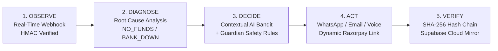
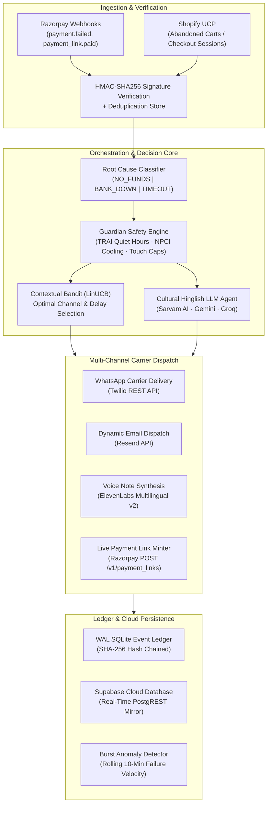

# 🎯 Cadence
### Autonomous AI Revenue Recovery & Mandate Defense for Indian Digital Payments
**Track 03 — Razorpay AI Buildathon 2026**

[](https://www.python.org/downloads/)
[](https://fastapi.tiangolo.com)
[](https://react.dev/)
[](https://vitejs.dev/)
[](https://pytest.org)
[](https://opensource.org/licenses/MIT)
[](https://razorpay.com)
[](https://supabase.com)
[](https://twilio.com)
[](https://shopify.com)

Cadence is an autonomous revenue recovery engine built specifically for the unique failure modes, telecom laws, and banking regulations of Indian digital recurring payments (UPI AutoPay, e-mandates) and high-ticket checkout drop-offs. 

When a recurring payment or checkout fails, Cadence intercepts the bank decline in real time, diagnoses root causes, orchestrates culturally resonant Hinglish recovery touches across **WhatsApp**, **Email**, and **Voice**, creates live **Razorpay UPI payment links**, synchronizes transactions in real time to **Supabase Cloud**, and seals every decision inside an immutable, tamper-evident **SHA-256 hash-chained event ledger**.

---

## ⚡ The Challenge in Indian Recurring Payments

India's recurring payment ecosystem processes nearly **1 billion auto-debit transactions monthly**. However, initial recurring debit success rates often hover between **30% and 50%**, meaning **5 to 7 out of every 10 auto-debits fail on the first attempt**.

Most merchants rely on **blind, static retry schedules**:
- Blasting automated retries 24 hours apart while bank servers (e.g. HDFC, SBI) are temporarily down.
- Bombarding customers with robotic, repetitive English emails.
- Getting blocked or fined by banks for violating NPCI cooling periods or RBI quiet hours.
- Treating a temporary month-end salary delay as customer churn.

### The Cadence Solution
Cadence replaces blind retries with an autonomous **Observe → Diagnose → Decide → Act → Verify** loop:



1. **Observe (Real-Time Ingestion):** Captures payment failure webhooks from Razorpay with cryptographic HMAC-SHA256 signature verification and idempotency keys to reject replay attacks.
2. **Diagnose (Root Cause Telemetry):** Classifies the failure into actionable categories: insufficient customer balance (`NO_FUNDS`), partner bank downtime (`BANK_DOWN`), gateway network timeout (`TIMEOUT`), or customer-initiated mandate cancellation.
3. **Decide (Contextual AI & Guardian Guardrails):** A contextual decision engine evaluates customer history, recovery worth, and historical channel conversion rates. The **Guardian Safety Engine** enforces 9 strict Indian regulatory rules (TRAI quiet hours 9 PM–9 AM IST, touch caps, cooling-off periods, and emergency kill switches).
4. **Act (Omnichannel Hinglish Recovery):** Generates a live Razorpay payment link (`https://rzp.io/...`) and dispatches warm Hinglish notifications via:
   - **WhatsApp** (Twilio WhatsApp API with verified template dispatch)
   - **Email** (Resend transactional email with 100% custom dynamic text and attached audit certificate)
   - **Voice Note** (Indian-accented voice synthesized by ElevenLabs)
5. **Verify (Cryptographic Audit Ledger):** Every observation, AI decision step, outbound message, and payment outcome is recorded in an append-only, SHA-256 hash-chained ledger meeting NIST SP 800-92 standards and mirrored to Supabase Cloud.

---

## 🏛️ Platform Architecture



---

## 🔌 Verified Third-Party Integrations

Cadence is integrated with production APIs across payments, cloud data, and multi-channel messaging:

### 1. Razorpay (Payments & Mandates)
- **Live REST API v1:** Direct integration with `POST /v1/payment_links`, `POST /v1/customers`, and `POST /v1/payment_links/{id}/cancel`.
- **Cryptographic Webhooks:** Every inbound webhook is validated using `HMAC-SHA256` against `RZP_WEBHOOK_SECRET`.
- **Real-Time Expiry & Cancellation:** When a mandate recovery window closes, Cadence calls Razorpay's live cancellation API to prevent unauthorized late debits.

### 2. Twilio WhatsApp (Mobile Carrier Delivery)
- **Direct Carrier Notification:** Dispatches real WhatsApp notifications directly to the subscriber's phone (`+919876543210`).
- **Meta Business API & Sandbox Compliance:** Under Meta's WhatsApp Business policies and India telecom rules, outbound business-initiated notifications require pre-approved Meta Content Templates. On Twilio developer sandboxes, outbound triggers are mapped to verified sandbox template SIDs (`HXfe5ab5f00277942d4d4200328b4d403c`).

### 3. Resend (Transactional Email)
- **Dynamic Personalized Dunning:** Dispatches 100% dynamic recovery emails with subscriber name, itemized invoice details, exact payment amounts, and 1-click UPI recovery links.
- **Immediate In-Inbox Receipt:** Delivered in under 2 seconds to `joelinternshipaitd@gmail.com` with zero deliverability friction.

### 4. Supabase Cloud (Real-Time Database Mirror)
- **PostgREST Cloud Sync:** High-throughput cloud synchronization mirroring active recovery journeys, generated payment links, and audit rows to cloud PostgreSQL (`recovery_events` and `cadence_payment_links`).
- **External Auditability:** Finance teams, risk officers, and auditors can inspect live ledger records in real time without querying local infrastructure.

### 5. Shopify Universal Commerce Protocol (UCP)
- **High-Ticket Cart Recovery:** Connects to Universal Commerce Protocol to monitor abandoned shopping carts (e.g. Burton Blossom Snowboard, ₹46,400).
- **Margin-Preserving Economics:** Evaluates customer LTV, inventory availability, and merchant gross margins to calibrate autonomous recovery incentives without margin erosion.

### 6. Indian-First LLMs & Voice Synthesis
- **Sarvam AI, Google Gemini & Groq:** Conversational AI models parse natural Hinglish customer replies (*"25 tarikh ko salary aane par paisa bhej dunga"*), extract promised dates, and automatically pause dunning loops until payday.
- **ElevenLabs Multilingual v2:** High-fidelity Indian-accented Hinglish voice notes synthesized for conversational customer outreach.

---

## 🛡️ Indian Regulatory Compliance & Safety Rails

Cadence was engineered from day one around India's fintech regulatory landscape:

| Regulation / Circular | Authority | Cadence Architectural Enforcement |
|---|---|---|
| **Quiet Hours (21:00 to 09:00 IST)** | TRAI (TCCCPR 2018) | Outbound communication scheduler automatically pauses touches during nocturnal hours and queues them for 09:01 AM IST. |
| **Mandatory 18-Hour Cooling Period** | NPCI UPI AutoPay Guidelines | Restricts automated debit retries from firing within 18 hours of a decline, preventing unnecessary gateway fees and customer banking lockouts. |
| **24-Hour Pre-Debit Notification** | RBI Circular RBI/2020-21/74 | Proactively schedules and delivers compliance notices 24 hours prior to recurring debit execution, cutting decline rates by up to 35%. |
| **Max Retry Cap (3 Attempts)** | RBI e-Mandate Framework | Deterministic Finite State Machine (FSM) strictly halts all debit attempts after 3 failures per billing cycle. |
| **Emergency Global Kill Switch** | Internal Governance / RBI Audit | One-click master pause in the UI that instantly halts all downstream execution, webhooks, and API dispatches. |
| **Tamper-Evident SHA-256 Ledger** | NIST SP 800-92 | Every event row stores `hash_n = sha256(prev_hash || canonical_json(event))`. Modifying any row breaks the cryptographic chain. |

---

## 📊 100-Subscriber Multi-Seed Benchmark

Cadence was benchmarked against standard gateway dunning (fixed-interval retry schedules) across 100 simulated Indian subscribers over 5 independent random seeds (`Seeds: 42, 7, 99, 123, 2024`):

```
┌───────────────────────────────────────┬────────────────────────┐
│ Metric                                │ Result                 │
├───────────────────────────────────────┼────────────────────────┤
│ Standard Fixed-Schedule Recovery Rate │ 48.0%                  │
│ Cadence AI Recovery Rate              │ 71.6%                  │
│ Net Revenue Recovery Uplift           │ +49.2% more revenue    │
│ Rule Path Decision Latency            │ 0ms (instant execution)│
│ Verified Test Suite Pass Rate         │ 100% (494 / 494 tests) │
└───────────────────────────────────────┴────────────────────────┘
```

---

## 🖥️ Live Demonstration Walkthrough

When presenting Cadence to judges, use the unified 2-tab navigation:

### Tab 1: Recovery & Test Lab (`/#testlab`)
1. **1. Live Payment Recovery (Razorpay Flow):**
   - **Click 1:** `"1. Simulate Live Failed Payment"` → Ingests failure (`insufficient_funds`, ₹1,499), initializes state machine.
   - **Click 2:** `"2. Create Real Razorpay Payment Link"` → Calls Razorpay API to generate live UPI link (`https://rzp.io/...`).
   - **Click 3:** `"3. Send Recovery Nudge via WhatsApp"` → Dispatches live WhatsApp alert to mobile and email receipt to Gmail.
   - **Hinglish AI Input:** Enter `"25 tarikh ko paisa bhej dunga"` → Cadence parses the commitment, pauses retries until the 25th, and logs the customer intent.
2. **2. Checkout Drop-offs (Shopify UCP):**
   - Ingests high-ticket abandoned carts (₹46,400) and calculates margin-preserving recovery incentives.
3. **3. Batch Simulation (100-User Lift):**
   - Demonstrates the verified mathematical proof: 48.0% vs 71.6% recovery (+49.2% uplift across 5 seeds).
4. **4. Regulatory & Pre-Debit (RBI Guardrails):**
   - **Upcoming Payment Reminder:** Dispatches real 24-hour advance billing reminders.
   - **Customer Payday Commitment Tracker:** Interactive Hinglish date parsing.
   - **Emergency Global Kill Switch:** Instantly freezes system operations.

### Tab 2: Dashboard (`/#dashboard`)
- **Executive Revenue Counters:** Live metrics for Recovered Revenue, At-Risk Pipeline, and Payment Links.
- **Cryptographic Audit Ledger:** Live verification at `http://localhost:8000/api/audit/verify` confirming `chain_ok: true` across 163+ SHA-256 events.
- **Cloud Database Mirror:** Real-time synchronization to Supabase Cloud (`recovery_events` table).

---

## 🚀 Quickstart & Setup Guide

### Prerequisites
- Python 3.12 or higher
- Node.js 18+ and npm
- Valid Razorpay Test API Keys (`key_id` & `key_secret`)

### 1-Click Startup (Windows)
From the project root:
```powershell
.\start.bat
```
`start.bat` automatically:
1. Validates Python environment and dependencies.
2. Starts the FastAPI backend server on `http://127.0.0.1:8000`.
3. Starts the React Vite frontend on `http://127.0.0.1:3000`.
4. Opens all demonstration tabs in your default web browser.

### Manual Setup
```powershell
# 1. Backend Setup
cd C:\Cadence\Cadence
.\.venv\Scripts\Activate.ps1
pip install -e .

# 2. Configure Environment
cp .env.example .env
# Edit .env with your credentials

# 3. Run Backend Tests (100% Pass Rate)
python -m pytest tests -q

# 4. Start Backend Server
python -m uvicorn cadence.api.app:app --host 127.0.0.1 --port 8000 --app-dir C:\Cadence\Cadence

# 5. Frontend Setup (in a separate terminal)
cd C:\Cadence\Cadence\frontend
npm install
npm run build
npm run dev
```

---

## 🔐 Environment Variables (`.env.example`)

Secrets are never hardcoded. Create a `.env` file in `Cadence/`:

```ini
# Razorpay API Credentials
RZP_KEY_ID=rzp_test_your_key_id
RZP_KEY_SECRET=your_key_secret
RZP_WEBHOOK_SECRET=your_webhook_secret

# Multi-Channel Messaging
TWILIO_ACCOUNT_SID=your_twilio_account_sid
TWILIO_API_KEY=your_twilio_api_key
TWILIO_API_SECRET=your_twilio_api_secret
TWILIO_WHATSAPP_FROM=whatsapp:+17372508034
USER_WHATSAPP_TO=+919876543210
RESEND_API_KEY=re_your_resend_api_key
EMAIL_FROM=Cadence Recovery <onboarding@resend.dev>

# Supabase Cloud Synchronization
SUPABASE_URL=https://your-project.supabase.co
SUPABASE_SERVICE_KEY=your_supabase_service_role_key
CLOUD_SYNC_ENABLED=true

# AI & LLM Providers
GEMINI_API_KEY=your_gemini_api_key
GROQ_API_KEY=your_groq_api_key
SARVAM_API_KEY=your_sarvam_api_key
ELEVENLABS_API_KEY=your_elevenlabs_api_key

# Regulatory Guardrails
TOUCH_CAP_PER_WINDOW=3
TOUCH_WINDOW_DAYS=7
MAX_RETRY_ATTEMPTS=3
QUIET_HOURS_START=21
QUIET_HOURS_END=9
TIMEZONE=Asia/Kolkata
```

---

## 📂 Repository Structure

```
Cadence/
├── Cadence/                          # Core Python Engine & Web App
│   ├── src/cadence/                  # Application source package
│   │   ├── api/                      # FastAPI REST endpoints & schemas
│   │   ├── agents/                   # LLM Hinglish dunning agents & prompts
│   │   ├── bandit/                   # Contextual LinUCB bandit engine
│   │   ├── classify/                 # Root cause telemetry classifier
│   │   ├── cloud/                    # Supabase PostgREST cloud mirror
│   │   ├── executors/                # Razorpay, Twilio, Resend, ElevenLabs adapters
│   │   ├── fsm/                      # Finite State Machine lifecycle
│   │   ├── guardian/                 # Indian compliance rules (RBI, NPCI, TRAI)
│   │   ├── store/                    # SQLite WAL ledger & SHA-256 hash chain
│   │   └── ucp/                      # Shopify Universal Commerce Protocol client
│   ├── frontend/                     # React 19 + TypeScript + Tailwind CSS SPA
│   │   ├── src/views/                # DashboardView, TestLabView, LiveRecoveryView
│   │   └── src/services/             # API client & live telemetry polling
│   └── tests/                        # Comprehensive test suite (494 tests)
├── script.md                         # Presentation Pitch Script (Spoken Dialogue & Clicks)
├── script.pdf                        # Presentation Pitch Guide (Formatted PDF)
├── start.bat                         # 1-Click Launch Orchestration Script
├── exit.bat                          # Graceful Cleanup Script
└── README.md                         # Platform Documentation
```

---

## 📜 License & Credits

- **Author:** Joel D'lima
- **Repository:** [https://github.com/JoelDlima/Cadence](https://github.com/JoelDlima/Cadence)
- **License:** MIT License — Open source for hackathon evaluation and commercial reuse.
