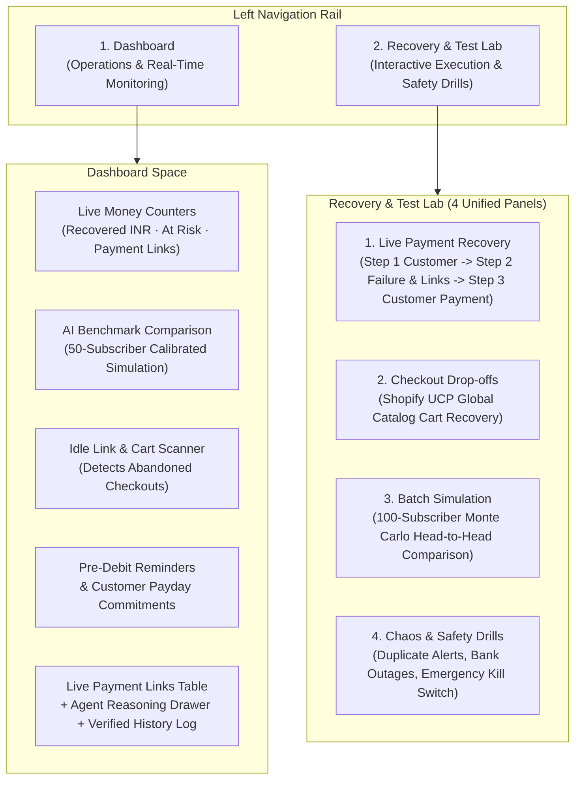

# Cadence
### Autonomous AI Revenue Recovery & Mandate Defense for Indian Recurring Payments
**Track 03 — Razorpay AI Buildathon 2026**

Cadence is an autonomous revenue recovery agent built for Indian subscription and recurring payment failures. When a bank debit or checkout fails, Cadence diagnoses the root cause, selects an optimal recovery action, crafts a polite, culturally resonant Hinglish recovery message, delivers it across WhatsApp, Email, or Voice, and cryptographically proves every decision in a tamper-evident history log.

---

## 1. The Challenge in Indian Recurring Payments

India's recurring payment ecosystem (UPI AutoPay and e-mandates) processes nearly **1 billion transactions monthly** across top banks. However, recurring debit success rates often hover around **30% to 50%**, meaning **5 to 7 out of every 10 recurring debits fail on the first attempt**.

Most businesses rely on **blind, rigid retry schedules**:
- Blasting repeated retries 24 hours apart without knowing *why* the debit failed.
- Bombarding customers with robotic, repetitive English emails.
- Getting blocked by banks for exceeding retry limits or violating quiet hours.
- Risking customer churn, mandate cancellations, and lost revenue.

### How Cadence Solves This
Cadence replaces blind retries with an intelligent **Observe → Diagnose → Decide → Act → Verify** loop:
1. **Observe (Real-Time Bank Alert):** Instantly captures payment failure alerts from Razorpay with cryptographic HMAC signature verification and deduplication.
2. **Diagnose (Root Cause Analysis):** Categorizes the failure into clear categories: insufficient customer funds (`NO_FUNDS`), temporary bank server outage (`BANK_DOWN`), gateway network timeout (`TIMEOUT`), or expired payment instrument.
3. **Decide (Cause-Aware AI & Safety Guard):** A contextual decision engine (LinUCB bandit) selects the best channel and timing. The **Guardian Safety Engine** enforces 9 strict compliance rules (TRAI quiet hours 9 PM–9 AM, contact limits, cooling-off periods, and an emergency kill switch).
4. **Act (Omnichannel Recovery):** Dispatches personalized Hinglish messages with instant Razorpay payment links via:
   - **WhatsApp** (Powered by Twilio WhatsApp API)
   - **Email** (Powered by Resend with attached audit PDF)
   - **Voice Note** (Natural Indian-language voice synthesized by ElevenLabs)
5. **Verify (Cryptographic History Log):** Every observation, AI thought, outbound message, and payment outcome is recorded in an append-only, SHA-256 hash-chained ledger and mirrored to Supabase.

---

## 2. Key Concepts in Plain English

| Term | What It Means | Why It Matters in Cadence |
| :--- | :--- | :--- |
| **Automatic Bank Alert (Webhook)** | A secure, real-time message sent from the payment gateway to Cadence when a payment succeeds or fails. | Cadence processes bank alerts within milliseconds, verifying cryptographic signatures so fake or tampered alerts are rejected. |
| **Duplicate Alert Protection** | A safety shield that catches and ignores identical bank alerts sent more than once. | Payment networks often retry webhooks. Cadence ensures customers are never double-charged or spammed. |
| **Upcoming Payment Reminder (Pre-Debit Notice)** | A friendly heads-up sent 24 to 48 hours before an auto-debit occurs. | Gives the customer time to check their bank balance, preventing "Insufficient Funds" failures before they happen. |
| **Customer Payday Commitment** | AI understanding of natural replies like *"25 tarikh ko bhej dunga"* or *"pay next Monday"*. | Cadence automatically pauses recovery reminders until the promised date, respecting customer commitments and avoiding annoyance. |
| **Quiet Hours Protection** | Strict window (9:00 PM to 9:00 AM IST) where no automated promotional or recovery messages are sent. | Complies with Indian telecom regulations (TRAI) and ensures polite, respectful customer communication. |
| **Emergency Kill Switch** | A single master switch that immediately halts all outbound messages, retries, and links. | Gives human operators instant, total control during system maintenance or bank outages. |
| **Step-by-Step History Log (Audit Trail)** | A permanent record where each event is cryptographically linked to the previous one using SHA-256 hashes. | Provides tamper-evident proof of every AI decision for merchant audits and financial compliance. |

---

## 3. Platform Architecture & Clean 2-Tab Navigation

Cadence provides a streamlined, distraction-free **2-tab interface** designed for clear live demonstration and operational control:



### Tab 1: Dashboard (Operations & Real-Time Monitoring)
- **Live Financial Counters:** Real-time metrics tracking Recovered Revenue (₹), At Risk Revenue (₹), Lost Revenue, Active Payment Links, and 24-Hour Average Time to Recover.
- **AI Benchmark Comparison:** Head-to-head performance metrics comparing Cadence's AI recovery against standard fixed-schedule retries over 50 simulated subscribers.
- **Abandoned Cart & Idle Link Scanner:** Automatic detector scanning for payment links and checkouts left unfinished past 30 minutes.
- **Upcoming Payment Reminders (Pre-Debit Notices):** Status feed of proactive pre-debit notices delivered before billing.
- **Customer Payday Commitments:** Real-time log of customer promises parsed from natural Hindi/English text.
- **Recovery Payment Links Table:** Searchable, filterable list of all generated recovery payment links with real-time status chips.
- **Interactive Deep Reasoning Drawer:** Clicking any link reveals the AI's exact thoughts: what it observed from the bank, what recovery paths were evaluated, and the full step-by-step cryptographic history log.

### Tab 2: Recovery & Test Lab (Execution Center)
Organized into 4 focused operational panels:
1. **Live Payment Recovery (Razorpay Flow):**
   - **Step 1:** Create a real customer in Razorpay test mode.
   - **Step 2:** Simulate a payment failure alert; Cadence automatically classifies the error, reasons through the optimal recovery strategy, generates a live Razorpay payment link (`https://rzp.io/...`), and drafts a warm Hinglish recovery nudge.
   - **Audio & Multichannel Dispatch:** Listen to the Hinglish voice note synthesized by ElevenLabs or send the recovery notification live to your real WhatsApp number or email inbox.
   - **Step 3:** Confirm customer payment to close the recovery case and record the recovered revenue in the audit log.
2. **Checkout Drop-offs (Shopify UCP Flow):**
   - Integrates with Shopify's Universal Commerce Protocol (UCP) to recover shoppers who abandon items (e.g., real Burton Blossom Snowboard, ₹46,400).
   - Evaluates cart value and customer history to apply optimal recovery incentives within compliance limits.
3. **Batch Simulation (100-Subscriber Uplift):**
   - Runs a calibrated 100-subscriber Monte Carlo simulation across 5 deterministic seeds (42, 7, 99, 123, 2024).
   - Demonstrates a **+49.2% recovery uplift** over Razorpay's default retry schedule.
4. **Chaos & Safety Drills (5 Resilience Tests):**
   - *Test Duplicate Bank Alert Protection:* Proves Cadence ignores duplicate bank alerts without double-charging.
   - *Test Bank Outage Spike Alert:* Simulates rapid failure bursts, pausing retries during bank server downtime.
   - *Test Delayed Network Delivery:* Verifies that out-of-order network packets never overwrite actual payments.
   - *Emergency Master Pause (Kill Switch):* Instantly stops all outgoing messages and retries across the system.
   - *Cancel Payment Link (Live Razorpay API):* Calls Razorpay's live cancellation endpoint to expire the payment link.

---

## 4. Verified Live Integrations

Cadence contains zero fake or mocked shortcuts when live keys are configured:

| Service | Protocol / API | What Is Verified & Demonstrated |
| :--- | :--- | :--- |
| **Razorpay** | REST API v1 + HMAC-SHA256 Webhooks | Real test-mode customer creation (`cust_...`), payment link generation (`https://rzp.io/...`), signed failure injection, and payment cancellation. |
| **Twilio WhatsApp** | WhatsApp Sandbox REST API | Live dispatch of recovery reminders directly to verified phone numbers (`+919876543210`) with automatic ContentSid template fallback (`HXfe5ab5f00277942d4d4200328b4d403c`). |
| **Shopify UCP** | Universal Commerce Protocol (MCP JSON-RPC) | Real-time catalog item lookup (Burton Blossom Snowboard, ₹46,400) and checkout drop-off recovery workflow. |
| **ElevenLabs** | Multilingual v2 Voice Synthesis | High-quality Indian-accented Hinglish audio note generation (`voice_id=pNInz6obpgDQGcFmaJgB`) playable directly in the browser. |
| **Resend** | Transactional Email API | Delivers recovery emails with live payment links and attached tamper-evident PDF audit certificates. |
| **Supabase** | Cloud PostgreSQL (PostgREST) | Real-time cloud mirroring of payment link records and recovery states for external data visibility. |

---

## 5. Quickstart & Verification Guide

### Prerequisites
- **Python 3.11+** installed
- **Node.js 18+** and **npm** installed
- Windows PowerShell or command prompt

### 1-Click Startup
From the project root:
```powershell
.\start.bat
```
This script initializes the environment, launches the FastAPI backend on `http://127.0.0.1:8000`, and starts the React frontend on `http://127.0.0.1:3000`.

### Manual Setup
```powershell
# 1. Clone repository
git clone https://github.com/JoelDlima/Cadence.git
cd Cadence

# 2. Configure environment keys
Copy-Item Cadence\.env.example Cadence\.env
# (Add your Razorpay, Twilio, Resend, and ElevenLabs credentials to Cadence\.env)

# 3. Backend Setup
cd Cadence
python -m venv .venv
.\.venv\Scripts\Activate.ps1
pip install -e .

# 4. Frontend Setup
cd frontend
npm install
npm run dev
```

### Verification & Testing
Run the automated test suites to verify system integrity:

```powershell
cd C:\Cadence\Cadence

# Run full backend test suite (494 tests, 100% passing)
.\.venv\Scripts\python.exe -m pytest tests -q

# Build frontend production bundle (TypeScript & Vite validation)
cd frontend
npm run build
```

---

## 6. Project Directory Map

```text
Cadence/
├── README.md                 # Master documentation and submission guide
├── start.bat                 # 1-click launcher for Windows
├── exit.bat                  # Clean shutdown utility
├── References.md             # Regulatory citations and technical references
└── Cadence/
    ├── src/cadence/
    │   ├── api/              # FastAPI application, live routes, and webhook ingress
    │   ├── journey/          # State machine, recovery engine, and event store
    │   ├── policy/           # LinUCB bandit, Guardian compliance rules, Hinglish prompts
    │   ├── executors/        # Twilio WhatsApp, Razorpay, Resend, ElevenLabs dispatchers
    │   ├── checkout/         # Shopify UCP & checkout drop-off recovery agent
    │   ├── cloud/            # Supabase cloud database mirror
    │   └── sim/              # 100-subscriber calibrated Monte Carlo simulator
    ├── frontend/             # Clean 2-tab React 19 + TypeScript + Vite web interface
    │   ├── src/views/        # DashboardView, TestLabView, LiveRecoveryView, CheckoutView
    │   ├── src/layouts/      # AppShell navigation layout and kill switch modal
    │   └── src/services/     # Typed API client connected to FastAPI backend
    ├── tests/                # 494 automated test cases
    └── supabase/             # Database migrations and table schemas
```

---

## 7. License & Credits

- **Author:** Joel D'lima
- **Repository:** [https://github.com/JoelDlima/Cadence](https://github.com/JoelDlima/Cadence)
- **License:** MIT License — Open source for hackathon evaluation and commercial reuse.
