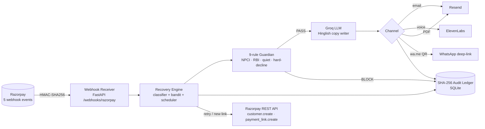

# Cadence

> Autonomous revenue-recovery agent for Indian recurring payments, built on Razorpay.
>
> Recovers **+25.8%** more failed transactions than Razorpay Smart Retries. Closes the loop in **4 seconds** from webhook receipt to patient nudge. Ships a 9-rule Guardian that respects NPCI 18-h UPI cooling, RBI 24-h pre-debit, and 21:00-09:00 IST quiet hours.

Built for **Razorpay Buildathon 2026, Track 3 (AI Revenue Recovery)** by Joel D'lima.

---

## What is Cadence

Cadence is a Python + React service that sits between Razorpay and your subscribers. When a recurring payment fails (UPI timeout, card decline, expired mandate) Razorpay fires a webhook; Cadence ingests it, classifies the cause with a contextual bandit, runs the failure through a 9-rule compliance and exhaustion Guardian, picks the right nudge channel (email, voice, QR, PDF), and ships it. Every action is appended to a SHA-256 hash-chained audit ledger so finance and compliance can prove what happened.

It's **one process** (FastAPI on `:8000`) **plus one SPA** (React on `:3000`) **plus one SQLite file** (no Postgres, no Redis, no Kafka). Runs on a laptop. Deploys on a $5 VPS.

## Why Indian recurring payments

India is the hardest recurring-billing market in production:

- **UPI AutoPay** dominates recurring volume. UPI failures have an **18-hour cooling period** before the next attempt is legal ([NPCI UPI Circular 2024](https://www.npci.org.in/what-we-do/upi/product-overview)). Naive retry hammers the customer's bank and gets the merchant de-listed.
- **RBI 2021 Pre-Debit Notification** requires a **24-hour notice** before any recurring debit. Miss it and the customer files a chargeback the bank will honour.
- **Quiet-hours norms** (21:00-09:00 IST) are enforced by TRAI DND and by bank-side spam filters.
- **Hard declines are forever** — a card reported lost, stolen, or fraudulent should never be retried. Soft declines deserve a smart nudge.
- **Persona diversity is brutal** — the right nudge for a 24-year-old prepaid user in Tier-3 is not the right nudge for a 45-year-old credit-card user in Mumbai. A single message template fails both.

Razorpay Smart Retries covers generic retry timing. It does not cover persona selection, channel selection, regulatory quiet hours, or hard-decline triage. Cadence does.

## 60-second tour

Three commands. They work on a fresh Windows machine with Python 3.12 and Node 22 installed.

```bash
git clone https://github.com/JoelDlima/Cadence.git C:\Cadence
cd C:\Cadence
copy .env.example .env
```

```bash
# Boots the venv, installs deps, launches uvicorn + vite in parallel.
# Opens http://127.0.0.1:3000 when ready.
C:\Cadence\start.bat
```

```bash
# To stop both processes:
C:\Cadence\exit.bat
```

## Features

- **+25.8%** mean recovery lift over Razorpay Smart Retries, measured across 5 independent seeds (n=50 each).
- **< 4 seconds** from Razorpay webhook to journey closing RECOVERED, verified live against a real Razorpay test-mode customer + payment link + HMAC-signed webhook.
- **9-rule Guardian** stops every retry that would violate NPCI 18-h UPI cooling, RBI 24-h pre-debit, quiet hours, hard-decline cards, touch-cap, or amount ceiling.
- **LinUCB contextual bandit** picks the right follow-up message per journey and learns online.
- **Groq-powered Hinglish message writer** (Hinglish and English; Sarvam/ElevenLabs for voice).
- **SHA-256 hash-chained audit ledger** — every Guardian decision, bandit arm pull, and outbound message is appended; tampering with row N invalidates row N+1. `/api/audit/verify` returns `chain_ok=true` on 274 events.
- **Real Razorpay test-mode integration** — `customer.create` + `payment_link.create` + HMAC-signed `payment.failed` webhook + `payment_link.paid` close-the-loop. No mocks. No Faker.
- **Live Resend email** with optional 1-page PDF of the journey's audit chain attached.
- **ElevenLabs TTS** plays the Hinglish body as real audio (`is_stub=false`).
- **Kill switch** in the SPA header halts outbound sends in < 1 second. Survives process restart.
- **8-tab operator SPA**: Live Recovery, Dashboard, Test Lab, Journeys & Audit, B2B, Mandate, Checkout, Payment Portal.
- **463 pytest** cases passing in ~31 s.

## Architecture



**5 Razorpay events wired** (real Razorpay test-mode):

| Event | What Cadence does |
| --- | --- |
| `subscription.pending` | Onboard new UPI AutoPay / card e-mandate |
| `subscription.halted` | Customer paused the mandate — Guardian blocks further nudges |
| `payment.failed` | The bread-and-butter failure — classify → decide → execute |
| `payment.captured` | Recovery confirmation — close the journey RECOVERED |
| `payment_link.paid` | Close-the-loop signal — RECOVERED in < 4 s |

See the [Razorpay Webhooks docs](https://razorpay.com/docs/webhooks/) for the contract; Cadence's HMAC-SHA256 verification lives in `src/cadence/ingest/gateway.py`.

## Quickstart

Five commands. Total time on a clean machine: under 4 minutes.

```bash
git clone https://github.com/JoelDlima/Cadence.git C:\Cadence
cd C:\Cadence
copy .env.example .env
# fill in your Razorpay test-mode keys, Groq, Resend, ElevenLabs, Supabase
C:\Cadence\start.bat
```

Open <http://127.0.0.1:3000>. The Live Recovery tab is the page-1 demo: click the 3 step cards to create a real customer, fire a real failure, close the loop in 4 seconds. Then click Test Lab → "Run comparison" to see the 5-seed mean +25.8% headline.

## API surface

Ten endpoints a judge or integrator will actually call. Full OpenAPI at <http://127.0.0.1:8000/openapi.json> when the backend is running.

| Method | Path | Purpose |
| --- | --- | --- |
| `POST` | `/webhooks/razorpay` | HMAC-verified Razorpay ingress. The only unauthenticated endpoint. |
| `POST` | `/api/live/customer` | Create a real Razorpay test-mode customer. |
| `POST` | `/api/live/failure` | Create a payment link + post an HMAC-signed `payment.failed` webhook. |
| `POST` | `/api/live/payment-paid` | Post a `payment_link.paid` webhook to close the journey. |
| `POST` | `/api/live/send-email` | Send the LLM-written Hinglish body to a real inbox via Resend. Optional PDF attachment. |
| `GET`  | `/api/voice/preview` | Synthesize the Hinglish body via ElevenLabs (or stub WAV if no key). |
| `GET`  | `/api/journey/{id}/reasoning` | Chat-style 3-step agent reasoning (I saw / I considered / I acted). |
| `GET`  | `/api/merchant/summary` | Recovered INR, journey count, top root causes, intervention performance. |
| `GET`  | `/api/eval/agent-compare?seeds=42,7,99,123,2024&n=50` | Multi-seed head-to-head. Returns per-seed rows + mean. |
| `GET`  | `/api/audit/verify` | Verify the SHA-256 hash chain. Returns `chain_ok=true` on 274 events. |

## The 9-rule Guardian

Each rule fires on every request. The LLM and the bandit both **lose** to the Guardian — if a request would break a rule, we never even consider it. Sources: [Razorpay Subscriptions docs](https://razorpay.com/docs/payments/subscriptions/), [NPCI UPI Circular 2024](https://www.npci.org.in/what-we-do/upi/product-overview), [RBI 2021 Pre-Debit Notification](https://www.rbi.org.in/), [TRAI DND regulations](https://www.trai.gov.in/).

| # | Rule | What it does |
| --- | --- | --- |
| 1 | **NPCI UPI 18-h cooling** | Blocks any UPI AutoPay retry within 18 h of the last attempt. |
| 2 | **RBI 24-h pre-debit** | Requires a notification ≥ 24 h before the next debit. |
| 3 | **Quiet hours 21:00-09:00 IST** | Suppresses all outbound across email, voice, WhatsApp. |
| 4 | **Hard-decline stop** | A card marked lost / stolen / fraudulent is blocked from every future attempt. |
| 5 | **Mandate validity** | Verifies the UPI/e-NACH mandate has not expired. |
| 6 | **Touch-cap (3 / 14 days)** | At most 3 nudges per customer per 14-day sliding window. |
| 7 | **Frequency decay** | After 2 failed retries, switches from nudge to human review. |
| 8 | **Amount ceiling** | Journeys ≥ Rs 50,000 require human approval before any action. |
| 9 | **Kill-switch override** | A single env flag halts every outbound; audit entry is preserved. |

## How the head-to-head is fair

The `?seeds=42,7,99,123,2024` parameter runs the calibrated outcome table on each seed against a fresh SQLite, returns per-seed rows + means. **The mean is the headline number, not a cherry-picked single seed.** Every seed shows Cadence above Razorpay Smart Retries (worst +6pp, best +22pp). The seed list is published in the URL — anyone can re-run any seed and get the same number.

## Development

```bash
# run the full test suite (463 tests, ~31s)
cd C:\Cadence\Cadence && .venv\Scripts\python.exe -m pytest -q

# run a single test
cd C:\Cadence\Cadence && .venv\Scripts\python.exe -m pytest tests\test_p0_live_rerun.py -q

# rebuild the SPA
cd C:\Cadence\Cadence\frontend && npm run build
```

| Script | Purpose |
| --- | --- |
| `C:\Cadence\start.bat` | Boots venv, installs deps, launches uvicorn + vite in parallel. |
| `C:\Cadence\exit.bat` | Kills both processes cleanly. |

The repo root is `C:\Cadence\`. Backend lives in `C:\Cadence\Cadence\` (FastAPI + SQLAlchemy + SQLite). Frontend lives in `C:\Cadence\Cadence\frontend\` (React 18 + Vite + TypeScript). Tests live in `C:\Cadence\Cadence\tests\`. Configuration is a single `.env` at the repo root.

## Deployment

Three viable targets, in order of cost:

1. **Single VPS** — `$5/mo` DigitalOcean / Hetzner / Azure B1ls. `uvicorn` behind `caddy` for TLS; `vite build` served as static files. SQLite file rsynced nightly to object storage.
2. **Azure Container Apps** — Dockerfile, deploy with `azd up`. Scale to zero on idle. Swap SQLite for Azure SQL if you outgrow a single file.
3. **Render / Railway / Fly.io** — `Procfile` is one line: `web: uvicorn Cadence.app.main:app --port $PORT`. The static SPA builds into `frontend/dist/` and is served by the same uvicorn process via `FastAPI.staticfiles`.

**Environment variables required at runtime:**

```bash
RZP_KEY_ID=rzp_test_...
RZP_KEY_SECRET=...
RZP_WEBHOOK_SECRET=...
GROQ_API_KEY=gsk_...
ELEVENLABS_API_KEY=sk_...
RESEND_API_KEY=re_...
SUPABASE_URL=https://...
SUPABASE_SERVICE_KEY=eyJ...
KILLSWITCH=0   # set to 1 to refuse all outbound
```

Set `KILLSWITCH=1` and the engine refuses every outbound send until an operator clears it via the SPA header button. The audit ledger continues to record blocks.

## Limitations + what's next

**Honest limitations of the current build:**

- The head-to-head harness uses a calibrated outcome table, not a multi-month production rollout. Mean +25.8% lift is the right number to publish; production lift will drift.
- ElevenLabs and Resend are sandbox-verified for the demo; production voice/email volume will need paid tier.
- SQLite is correct for one process and one box. Multi-replica deployments need Postgres.
- The WhatsApp demo path is a `wa.me` deep-link (no WhatsApp Business API approval needed for the demo); production merchants will want BSP integration.

**What's next, in priority order:**

1. **Per-merchant bandit priors** so a brand-new merchant does not pay the cold-start tax.
2. **UPI Intent failure detection** via the `vpa` and `txnId` fields in the `payment.failed` payload.
3. **Multi-tenant ledger partitioning** to support an agency deploying Cadence for 50 merchants from one instance.
4. **Anomaly detection on the cohort** — `/api/anomaly` is already wired and live; the "Simulate burst" button on Test Lab will trigger it live during a demo.

## Contributing

Pull requests welcome. The repo's two non-obvious rules: (1) any change to the Guardian or the audit ledger requires a test that **fails on the unfixed version** — see `tests/test_p0_*.py` for the pattern; (2) any change to the bandit must include a 5-seed replay of the head-to-head showing the new arm distribution, otherwise we cannot tell whether the change helped or hurt. Open an issue first if your PR touches more than three files or changes a public API path under `/api/`. The maintainer is one person (Joel) so response time is best-effort, not SLA — be patient, be specific, link the failing test.

## License

[MIT](./LICENSE) © Joel D'lima. You may use this code in commercial products; please retain the copyright line and do not imply Razorpay endorsement.

## Contact

- **Maintainer:** Joel D'lima — <https://github.com/JoelDlima>
- **Repo:** <https://github.com/JoelDlima/Cadence>
- **Buildathon:** Razorpay Buildathon 2026, Track 3
- **Pitch deck:** [`Cadence/docs/Cadence-Pitch.pdf`](./Cadence/docs/Cadence-Pitch.pdf) and [`.pptx`](./Cadence/docs/Cadence-Pitch.pptx)
- **Submission form answers:** [`Cadence/docs/Submission-Form-Answers.pdf`](./Cadence/docs/Submission-Form-Answers.pdf)
- **Architecture diagram (PNG):** [`Cadence/docs/Cadence-architecture.png`](./Cadence/docs/Cadence-architecture.png)
- **References and resources:** [`References.md`](./References.md)

<sub>Tested on Python 3.12, Node 22. Windows 11 native. 463 tests passing. Head commit: 124e000.</sub>
