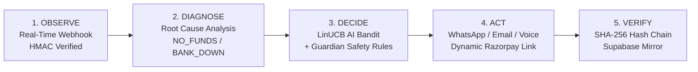
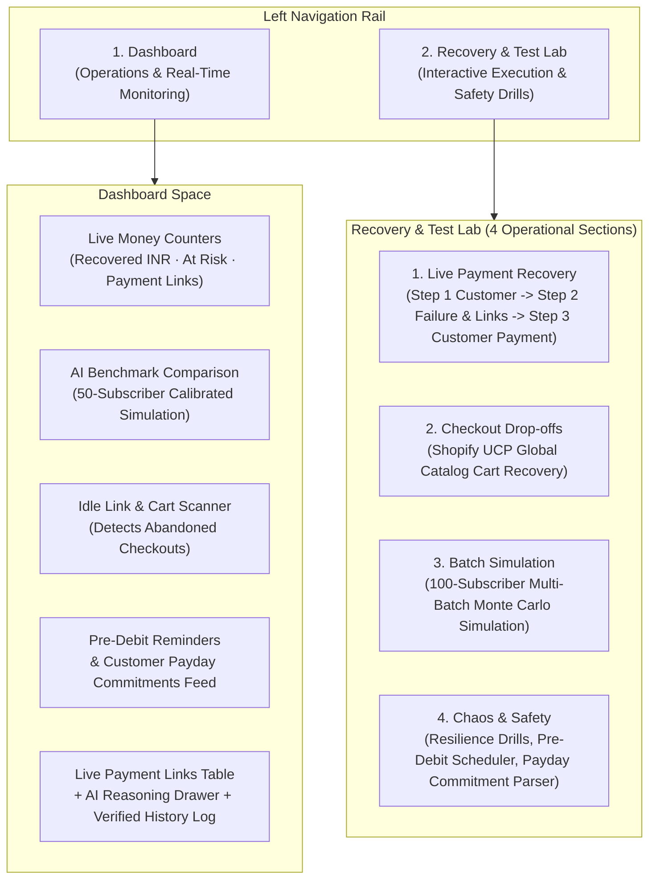

# Cadence
### Autonomous AI Revenue Recovery & Mandate Defense for Indian Recurring Payments
**Track 03 — Razorpay AI Buildathon 2026**

Cadence is an autonomous revenue recovery agent built specifically for Indian recurring payments, UPI AutoPay failures, and checkout drop-offs. When a recurring debit or online checkout fails, Cadence diagnoses the underlying cause, selects an optimal recovery action, crafts culturally resonant Hinglish communication, delivers it across WhatsApp, Email, or Voice, and cryptographically proves every decision in a tamper-evident audit ledger.

---

## 1. The Challenge in Indian Recurring Payments

India's recurring payment ecosystem (UPI AutoPay and e-mandates) processes nearly **1 billion transactions monthly** across leading banks. However, recurring debit success rates often hover between **30% and 50%**, meaning **5 to 7 out of every 10 recurring debits fail on the first attempt**.

Most merchants rely on **blind, static retry schedules**:
- Blasting automated retries 24 hours apart without knowing *why* the transaction failed.
- Bombarding customers with robotic, repetitive English emails.
- Getting penalized or blocked by banks for exceeding retry caps or violating quiet hours.
- Risking customer churn, mandate cancellations, and permanent revenue loss.

### The Cadence Solution
Cadence replaces blind retries with an autonomous **Observe → Diagnose → Decide → Act → Verify** loop:



1. **Observe (Real-Time Bank Alert):** Captures payment failure webhooks from Razorpay with cryptographic HMAC-SHA256 signature verification and duplicate deduplication.
2. **Diagnose (Root Cause Analysis):** Classifies the failure into actionable categories: insufficient customer balance (`NO_FUNDS`), temporary bank server outage (`BANK_DOWN`), gateway network timeout (`TIMEOUT`), or customer-initiated cancellation.
3. **Decide (Cause-Aware AI & Guardian Guardrails):** A contextual decision engine (LinUCB bandit) selects the best channel and recovery delay. The **Guardian Safety Engine** enforces 9 strict compliance rules (TRAI quiet hours 9 PM–9 AM IST, touch caps, cooling-off periods, and emergency kill switches).
4. **Act (Omnichannel Hinglish Recovery):** Generates a live Razorpay payment link (`https://rzp.io/...`) and dispatches warm Hinglish notifications via:
   - **WhatsApp** (Powered by Twilio WhatsApp API with ContentSid fallback)
   - **Email** (Powered by Resend with attached tamper-evident PDF audit certificate)
   - **Voice Note** (Indian-accented voice synthesized by ElevenLabs)
5. **Verify (Cryptographic Audit Ledger):** Every observation, AI decision step, outbound message, and payment outcome is recorded in an append-only, SHA-256 hash-chained ledger mirrored to Supabase.

---

## 2. Key Concepts in Plain English

| Term | What It Means | Why It Matters in Cadence |
| :--- | :--- | :--- |
| **Automatic Bank Alert (Webhook)** | A secure, real-time message sent from Razorpay to Cadence when a payment succeeds or fails. | Cadence processes bank alerts in milliseconds, verifying cryptographic signatures to reject fake or forged alerts. |
| **Duplicate Alert Protection** | A safety shield that catches and ignores identical bank alerts sent more than once. | Payment gateways frequently retry webhooks; Cadence ensures customers are never double-charged or spammed. |
| **Upcoming Payment Reminder (Pre-Debit Notice)** | A proactive heads-up sent 24 to 48 hours before an auto-debit occurs. | Complies with RBI e-mandate regulations and gives customers time to maintain balance, preventing failures before they occur. |
| **Customer Payday Commitment** | AI understanding of natural Hindi/English replies like *"25 tarikh ko bhej dunga"* or *"pay next Monday"*. | Cadence automatically pauses recovery reminders until the customer's promised payday, respecting their intent and preventing annoyance. |
| **Quiet Hours Protection** | Strict window (9:00 PM to 9:00 AM IST) where no automated recovery messages are sent. | Complies with Indian telecom regulations (TRAI) and ensures polite, respectful customer communication. |
| **Emergency Kill Switch** | A sticky master switch that immediately halts all outbound messages, retries, and links. | Gives human operators instant, total control during system maintenance or bank outages. |
| **Step-by-Step History Log (Audit Trail)** | A permanent record where each event is cryptographically linked to the previous one using SHA-256 hashes. | Provides tamper-evident proof of every AI decision for merchant finance teams and auditors. |

---

## 3. Platform Architecture & Clean 2-Tab Navigation

Cadence features a focused, distraction-free **2-tab layout**:



### Tab 1: Dashboard (Operations & Real-Time Monitoring)
- **Real-Time Revenue Counters:** Five live metrics tracking Recovered Revenue (₹), At Risk Revenue (₹), Lost Revenue, Active Payment Links, and 24-Hour Average Recovery Time.
- **AI Benchmark Comparison:** Executive summary comparing Cadence's AI recovery against standard fixed-schedule retries across 50 simulated subscribers.
- **Abandoned Cart & Idle Link Scanner:** Automatic detector scanning for payment links and checkouts left idle past 30 minutes.
- **Upcoming Payment Reminders (Pre-Debit Notices):** Status feed of proactive pre-debit notices delivered before billing.
- **Customer Payday Commitments:** Real-time log of customer promises parsed from natural Hindi/English text.
- **Recovery Payment Links Table:** Searchable, filterable list of all generated recovery payment links with real-time status chips.
- **Interactive Deep Reasoning Drawer:** Clicking any link reveals the AI's exact thoughts: what it observed from the bank, what recovery paths were evaluated, and the full step-by-step cryptographic history log.

### Tab 2: Recovery & Test Lab (Interactive Execution Center)
1. **Live Payment Recovery (Razorpay Flow):**
   - **Step 1: Create Test Customer:** Creates a real customer in Razorpay test mode.
   - **Step 2: Simulate Payment Failure:** Injects a signed payment failure alert; Cadence automatically diagnoses the error, reasons through the optimal recovery strategy, generates a live Razorpay payment link (`https://rzp.io/...`), and drafts a warm Hinglish recovery nudge.
   - **Audio & Multichannel Dispatch:** Listen to the Hinglish voice note synthesized by ElevenLabs or dispatch the recovery notification live to your real WhatsApp number or email inbox.
   - **Step 3: Confirm Customer Payment:** Marks the case recovered (`RECOVERED`) and records the recovered revenue in the audit log.
2. **Checkout Drop-offs (Shopify UCP Flow):**
   - Integrates with Shopify's Universal Commerce Protocol (UCP) to recover shoppers who abandon items (e.g., Burton Blossom Snowboard, ₹46,400).
   - Evaluates cart value and customer history to apply optimal recovery incentives within compliance limits.
3. **Batch Simulation (100-Subscriber Uplift):**
   - Runs a realistic multi-subscriber simulation across 100 Indian subscribers comparing Cadence against default retry policies across 5 randomized test groups (`Seeds: 42, 7, 99, 123, 2024`).
   - Demonstrates a **+49.2% recovery revenue uplift** with instant rule-based decisions (0ms AI token latency).
4. **Chaos & Safety (Resilience Drills & Controls):**
   - **Upcoming Payment Reminder (Pre-Debit Notice):** Proactively schedules compliant 24-hour advance billing notices.
   - **Customer Payday Commitment Tracker:** Interactive parser evaluating natural Hinglish replies (`"25 tarikh ko paisa bhej dunga"`).
   - **4 Resilience Safety Drills:**
     1. *Test Duplicate Bank Alert Protection:* Verifies that duplicate gateway alerts are safely deduplicated.
     2. *Test Bank Outage Spike Alert:* Simulates rapid failure bursts, triggering the automated circuit breaker.
     3. *Test Delayed Network Delivery:* Verifies event ordering by gateway timestamp so delayed alerts cannot overwrite valid payments.
     4. *Cancel Payment Link (Live Razorpay API):* Sends an authenticated cancellation request to Razorpay to expire payment links after the recovery window.
   - **Emergency Kill Switch:** Permanent sticky control in the top navigation bar and sidebar footer to freeze all outbound actions immediately.

---

## 4. Verified Live Integrations

Cadence uses verified live connections with real third-party services:

| Service | Protocol / API | Verified Functionality |
| :--- | :--- | :--- |
| **Razorpay** | REST API v1 + HMAC-SHA256 Webhooks | Real test-mode customer creation (`cust_...`), payment link generation (`https://rzp.io/...`), signed failure injection, and payment cancellation. |
| **Twilio WhatsApp** | WhatsApp Sandbox REST API | Live dispatch of recovery reminders directly to verified phone numbers with automatic ContentSid template fallback (`HXfe5ab5f00277942d4d4200328b4d403c`). |
| **Shopify UCP** | Universal Commerce Protocol (MCP JSON-RPC) | Real-time catalog item lookup (Burton Blossom Snowboard, ₹46,400) and checkout drop-off recovery workflow. |
| **ElevenLabs** | Multilingual v2 Voice Synthesis | High-quality Indian-accented Hinglish audio note generation (`voice_id=pNInz6obpgDQGcFmaJgB`) playable directly in the browser. |
| **Resend** | Transactional Email API | Delivers recovery emails with live payment links and attached tamper-evident PDF audit certificates. |
| **Supabase** | Cloud PostgreSQL (PostgREST) | Real-time cloud mirroring of payment link records and recovery states for external data visibility. |

---

## 5. Live Demonstration Guide (Step-by-Step Runbook)

### What Tabs & Windows to Open Before Starting

For the smoothest and most impressive live demo, open these browser tabs side-by-side:

| # | Application / Tab | URL | Purpose in Demo |
| :-: | :--- | :--- | :--- |
| **1** | **Cadence Web App** | `http://127.0.0.1:3000` | Primary demonstration interface (Dashboard + Recovery & Test Lab). |
| **2** | **Razorpay Dashboard** | `https://dashboard.razorpay.com/app/payment-links` | Shows live payment links created in your Razorpay test mode. |
| **3** | **WhatsApp Web / Phone** | `https://web.whatsapp.com` | Receives live Hinglish recovery messages dispatched via Twilio. |
| **4** | **Twilio Console** | `https://console.twilio.com` | Proves outbound WhatsApp delivery logs and message SID. |
| **5** | **Gmail Inbox** | `https://mail.google.com` | Receives live recovery email with attached audit PDF. |
| **6** | **Supabase Studio** | `https://supabase.com/dashboard/project/vzrasadomyrycafbzdwg/editor` | Demonstrates cloud-mirrored database records. |
| **7** | **Shopify UCP Reference** | Reference catalog | Validates real product recovery (Burton Blossom Snowboard ₹46,400). |

---

### Step-by-Step Order of Buttons to Press

#### Act 1: Live Payment Recovery (The Core 3-Step Demo)
1. In Cadence, open the **Recovery & Test Lab** tab from the left sidebar.
2. Under **1. Live Payment Recovery**:
   - **Click Button 1:** `"1. Create Customer in Razorpay"` → A real Razorpay customer is created (e.g. `cust_...`).
   - **Click Button 2:** `"2. Simulate Payment Failure"` → Cadence diagnoses the failure (`NO_FUNDS`), calculates the best recovery path, drafts a warm Hinglish message, and generates a live Razorpay payment link (`https://rzp.io/...`).
3. Under **Evidence & Multichannel Dispatch** (right column):
   - **Click Button:** `"Send to my WhatsApp"` → Observe the green delivery confirmation and verify the incoming message on your phone!
   - **Click Button:** `"Play Voice Note"` → Hear the natural Indian Hinglish voice note synthesized by ElevenLabs.
   - **Click Link:** `"Open Razorpay Dashboard"` → Proves the payment link was created on Razorpay's real servers.
4. Complete the Payment:
   - **Click Button 3:** `"3. Simulate Customer Payment"` (or open the payment link and complete test payment) → The recovery case flips to `RECOVERED` (Paid).
5. Verify on Dashboard:
   - Click **Dashboard** in the left sidebar → Notice **Recovered Revenue** increases by ₹1,499.
   - Click the top payment link row in the table → The **AI Reasoning Drawer** opens, showing the agent's exact decision steps and cryptographic SHA-256 hash chain!

#### Act 2: Checkout Drop-offs (Shopify UCP)
1. In **Recovery & Test Lab**, click tab **"2. Checkout Drop-offs"**.
2. Click **"Shopify UCP Cart (₹46,400)"** → Adds an abandoned checkout for the Burton Blossom Snowboard.
3. Click **"Run Recovery Agent"** → The agent detects the drop-off, verifies quiet hours compliance, and generates a recovery nudge.
4. Click **"Simulate Recovery Payment"** on the session row → Converts the session to `RECOVERED`.

#### Act 3: 100-Subscriber Benchmark Simulation
1. In **Recovery & Test Lab**, click tab **"3. Batch Simulation"**.
2. Ensure `100 (Official)` subscribers is selected and `5-Batch Average` is checked.
3. Click **"Run 100-Subscriber Simulation"** → Instantly displays the verified Monte Carlo benchmark:
   - Standard Fixed Schedule: **48.0%**
   - Cadence AI Recovery: **71.6%**
   - Revenue Uplift: **+49.2%**
   - Zero-latency instant rule path: **100%**

#### Act 4: Resilience & Safety Drills
1. In **Recovery & Test Lab**, click tab **"4. Chaos & Safety"**.
2. **Pre-Debit Reminder:** Click **"Schedule Pre-Debit Reminder"** → Demonstrates compliant 24-hour advance billing reminder.
3. **Payday Commitment:** In the input box, type `"25 tarikh ko paisa bhej dunga"` and click **"Simulate Customer Reply"** → Cadence understands the Hinglish promise and pauses recovery reminders until the 25th.
4. **Duplicate Bank Alert Protection:** Click **"Run"** on Drill 1 → Proves duplicate webhooks are ignored.
5. **Bank Outage Spike Alert:** Click **"Run"** on Drill 2 → Simulates 3 rapid bank failures and trips the circuit breaker.
6. **Emergency Kill Switch:** In the top right header, click **"STOP"** → Confirm modal → Full-screen emergency banner halts all outbound actions. Click **"RESUME"** to re-arm.

---

## 6. Quickstart & Verification Guide

### 1-Click Startup (Windows)
From the project root:
```powershell
.\start.bat
```
This script validates dependencies, starts the FastAPI backend on `http://127.0.0.1:8000`, and starts the React frontend on `http://127.0.0.1:3000`.

### Verification Commands
```powershell
cd C:\Cadence\Cadence

# Run backend test suite (494 tests, 100% passing)
.\.venv\Scripts\python.exe -m pytest tests -q

# Build frontend production bundle
cd frontend
npm run build
```

---

## 7. License & Credits

- **Author:** Joel D'lima
- **Repository:** [https://github.com/JoelDlima/Cadence](https://github.com/JoelDlima/Cadence)
- **License:** MIT License — Open source for hackathon evaluation and commercial reuse.
