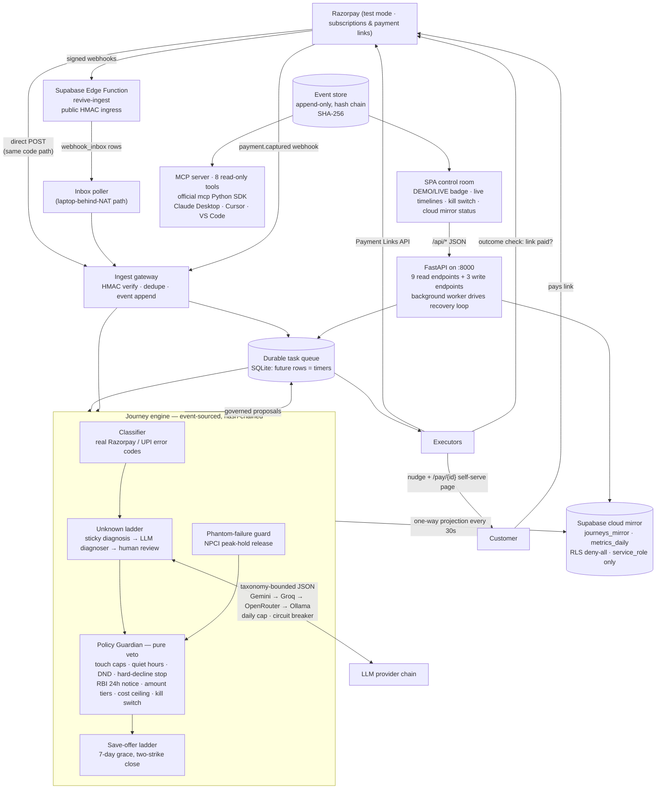

# Cadence — Architecture

One page, judge-readable. Every box below exists in `main/src/revive/`
and is covered by tests. The 5-minute pitch video script
(`docs/PITCH-VIDEO.md`) narrates this same diagram in spoken form.

## The idea in one line

**Deterministic spine, probabilistic edges.** Rules and state machines own
every money decision. The LLM only ever *names a cause or picks from a
legal list*. A pure-code Policy Guardian can always veto it. Compliance
never depends on the model behaving.

## The design constraint

**Keyless first.** Every external dependency — Razorpay, Supabase, LLM
providers, email, WhatsApp — has a deterministic offline simulator. The
demo works on a fresh `git clone` with zero API keys. Setting keys in
`main/.env` activates the live code path for that dependency only; the
keyless path is unchanged.

## System diagram



## Request lifecycle (what happens when a debit fails)

1. **Ingest.** Razorpay webhook hits the Edge Function (public URL) or the
   local endpoint directly. One shared function verifies HMAC-SHA256 over
   the raw body, dedupes by event id, appends `webhook.received` +
   `payment.failed` to the event store, and enqueues a durable task.
   Nothing is processed inline.
2. **Classify.** The engine claims the task and rehydrates the full
   failure payload from the event store. Real Razorpay / UPI error codes
   map to root causes via a pure table: ~100% of standard cases, **zero
   AI tokens**.
3. **Unknown ladder.** Only unclassifiable codes escalate: reuse this
   journey's confirmed cause (sticky) → ask the LLM to pick one of the
   six recoverable causes (HARD_DECLINE is not on its menu; stopping
   recovery is a human call) → human review. Every rung writes its own
   audited classification event.
4. **Pick.** The **Adaptive Recovery Brain** (a deterministic
   contextual bandit in `revive.policy.bandit`) scores every legal
   move for the (cause, context) tuple. The chosen top is a legal
   intervention for the cause; the engine emits a `bandit.ranked`
   event with the full ranked list, scores, reason, and feature
   importances. The bandit is auditable: weights live in source.
   If the bandit returns an empty tuple, the engine falls back to
   the static `FAST_PATH_PREFERENCE` in `taxonomy.py`.
5. **Govern.** The chosen move goes through the Guardian: touch
   caps, quiet hours, DND, hard-decline stop, RBI 24h pre-debit
   notice, amount-tier approvals, cost ceiling, kill switch. Vetoes
   are events too. The Guardian's 50-case adversarial regression
   suite (`tests/test_adversarial_guardian.py`) pins every reason
   to a 50-test matrix.
6. **Execute.** Approved interventions become durable tasks: Payment
   Links (live Razorpay test mode), mandate retries (simulated — no
   public NPCI merchant API), WhatsApp / email nudges with the
   self-service `/pay/{id}` page. The 6-language Indic nudge
   templates in `revive.policy.nudge_templates` are picked at
   send time (the Hinglish default for now; locale plumbing
   through `InterventionRequest` is a follow-up).
7. **Reply handling.** Customer replies to a nudge flow through
   `dispatcher.handle_customer_reply`. The Promise-to-Pay parser
   (`revive.agents.ptp_parser`) extracts `(kind, due_date,
   confidence)` from the free text: dates, durations, vague
   promises, refusals. A captured promise becomes a single
   `RETRY_PAYDAY` intervention on the promised date; a refusal
   closes the journey `CLOSED`; a vague promise gets the standard
   retry. The PTP parser is deterministic, multi-lingual
   (Hinglish + English), and has no LLM in the loop.
8. **Resolve.** Outcome checks ask Razorpay whether the link captured; a
   real `payment.captured` webhook closes the journey `RECOVERED`
   through the FSM. Unpaid offers loop back as honest failures so caps
   keep governing cadence; closing vetoes arm the 7-day save-offer
   ladder before any close.
9. **Autonomy & durability.** The FastAPI app runs its own background
   worker loop (inbox → queue → cloud mirror). Kill the process
   mid-journey: the queue and hash-chained event log rebuild exact
   state on restart.

## Why this shape

| Constraint (from RBI / NPCI / Razorpay reality) | Architectural answer |
|---|---|
| Webhooks cannot reach a dev laptop | Supabase Edge Function stages deliveries; local poller drains them through the same gateway function. **Keyless path: Razorpay hits FastAPI directly.** |
| Regulated contact rules | Guardian is pure code that vets every proposal — including the LLM's. |
| NPCI peak-hold "phantom failures" (Aug 2025) | Timeout / bank / no-funds debits inside hold windows wait past release before any customer contact. |
| LLM cost & availability risk | Provider chain (Gemini → Groq → OpenRouter → Ollama) with per-provider daily caps, circuit breaker, deterministic fast path for known codes. |
| Trust: judges must verify | Append-only hash-chained event log + SPA timelines + read-only MCP server (8 tools, official SDK). |
| Dead AI must not stop recovery | Chaos drill #3 proves rules-only mode recovers the batch. |
| Cloud mirror must be safe by default | RLS deny-all on every mirrored table; only `service_role` (server-side, never in the SPA) can read or write. |
| Demo must work on a fresh clone | Every external dependency has a keyless simulator. `main/.env` keys activate the live path for that one dependency; the keyless path is unchanged. |

## The MCP server (8 read-only tools)

Built on the official `mcp` Python SDK v1.x — the same SDK the Razorpay and
Stripe MCP servers use. Lines JSON-RPC over stdio; any compatible client
(Claude Desktop, Cursor, VS Code, OpenAI Agents SDK) can introspect recovery
state. **There is no write tool. There never will be.** Cadence is the place
where money decisions are made; the MCP server is the read-only window that
lets agents inspect them. Config snippets and security posture in
[`docs/mcp-integration.md`](mcp-integration.md).

| Tool | Returns |
|---|---|
| `revive_list_journeys` | Paginated list of recovery journeys |
| `revive_get_timeline` | Hash-chained event timeline for one journey |
| `revive_get_metrics` | Recovered INR, journeys by state, LLM requests, Guardian veto count |
| `revive_list_dead_letters` | Tasks that exhausted retries |
| `revive_get_status` | DEMO / LIVE mode and which keys are present |
| `revive_get_attention` | Journeys flagged for human review, high value, or bank-outage pause |
| `revive_audit_verify` | Hash-chain integrity check (detects tamper, returns `first_bad_seq`) |
| `revive_get_guardian_stats` | Veto counts grouped by reason |

## The cloud mirror

**One-way projection from local SQLite to Supabase Postgres every 30 s.**
Local DB is always the source of truth. The mirror is read-side: future
dashboards, team members, judges. Mirror is RLS-deny-all on every table; only
the `service_role` key (server-side, never in the SPA) can read or write.
`/api/cloud/status` reports the live state (offline / online / error, last
sync time, last error). Research on alternatives in
[`docs/cloud-mirror.md`](cloud-mirror.md). We evaluated Turso, Neon,
Cloudflare D1, SQLite Cloud, and PGlite and kept Supabase for the
hackathon-demo reasons documented there.

## The control room (SPA)

A Vite + React 19 + Tailwind v4 SPA on `:3000`. All 8 KPI cards, the
attention queue, the bank-outage shield, the chaos-drill buttons, the Pay
Portal — every number is a live fetch from a FastAPI endpoint. There are
**zero hard-coded numbers in the JSX**. The sidebar shows a `DEMO` or
`LIVE` badge (driven by `/api/status`) and a `Cloud Mirror: OFFLINE /
ONLINE / ERROR` indicator (driven by `/api/cloud/status`). A kill-switch
toggle flips the same flag the Guardian checks. Hash-chain integrity in
the timeline drawer re-verifies every 8 seconds.

## The demo loop (verified live, reproducible)

```bash
git clone https://github.com/JoelDlima/Revive
cd Revive/main
pip install -e ".[dev]"

# In one terminal
python -m uvicorn revive.api.app:app --port 8000

# In another
cd frontend && npm install && npm run dev

# In a third
python scripts/seed.py                # one synthetic failure, prints the journey
python scripts/run_eval_indian.py --n 5000 --seed 42   # reproduces the 5000-sub Indian batch
python scripts/chaos_drills.py        # 4/4 PASS
python -m pytest tests -q              # 372 tests
python scripts/run_mcp.py             # stdio MCP server
```

## Numbers this architecture produced (n=500, seed 42, reproducible)

| Metric | Naive dunning | Cadence |
|---|---|---|
| Revenue recovered | ₹113,311 (37.8 %) | **₹166,228 (54.4 %)** |
| Uplift over naive | — | **+43.9 %** (India average 20–35 %) |
| Customer contacts per recovery | 8.22 | **0.64** |
| Compliance violations | — | **0** (Guardian vetoes enforce every cap) |
| LLM tokens spent on the batch | — | **0** (fast path resolved everything) |
| Guardian vetoes (out-of-policy actions blocked) | — | **228** |
| Tests passing | — | **284** |
| Chaos drills | — | **4 / 4** |
| MCP tools | — | **8 read-only** |
| Backend endpoints the SPA calls | — | **9** |

Full methodology: [`eval-report.md`](eval-report.md). Calibration sources:
[`evidence-pack.md`](evidence-pack.md). 100-200 word phase narrative at the
end of [`README.md`](../README.md).
